# Planetary Imaging Post-Processing Pipeline — User Guide

---

## Table of Contents

1. [Overview](#1-overview)
2. [Main Window Layout](#2-main-window-layout)
3. [Global Settings](#3-global-settings)
4. [Step 01 — PIPP Preprocessing](#4-step-01--pipp-preprocessing)
5. [Step 02 — AutoStakkert!4](#5-step-02--autostakkert4)
6. [Step 03 — Wavelet Preview Sharpening](#6-step-03--wavelet-preview-sharpening)
7. [Step 04 — Quality Assessment & Window Detection](#7-step-04--quality-assessment--window-detection)
8. [Step 05 — De-rotation Stacking](#8-step-05--de-rotation-stacking)
9. [Step 06 — Wavelet Master Sharpening](#9-step-06--wavelet-master-sharpening)
10. [Step 07 — RGB Composite (Master)](#10-step-07--rgb-composite-master)
11. [Step 08 — Time-Series RGB Composite](#11-step-08--time-series-rgb-composite)
12. [Step 09 — Animated GIF](#12-step-09--animated-gif)
13. [Step 10 — Summary Grid](#13-step-10--summary-grid)
14. [Run All](#14-run-all)
15. [Output Folder Structure](#15-output-folder-structure)

---

## 1. Overview

This tool automates the planetary imaging post-processing pipeline. Starting from SER videos preprocessed with PIPP, it accepts AutoStakkert!4 stacking results and guides you through wavelet sharpening → quality assessment → de-rotation stacking → RGB compositing → time-series animation → summary grid generation.

### 1.1 Camera Modes

This pipeline supports two camera modes.

| Mode | Description | Filter Setup |
|------|-------------|--------------|
| **Mono** | Monochrome camera with a filter wheel. Separate SER file per filter. | Multiple filters: IR, R, G, B, CH4, etc. |
| **Color** | Single color (Bayer) camera. Continuous capture without filter switching. | COLOR (single channel) |

Selecting the camera mode in Global Settings automatically switches the UI and parameters in Steps 04, 07, and 08.

### 1.2 Complete Workflow

```
Raw SER Videos (from Firecapture)
         │
         ▼
[Step 01] PIPP Preprocessing     ← SER → Cropped SER (Optional)
         │
         ▼
[Step 02] AutoStakkert!4         ← Manual external execution
         │
         ▼
[Step 03] Wavelet Preview        ← TIF → Sharpened PNG (Required)
         │
         ▼
[Step 04] Quality Assessment     ← Optimal time window detection (Required)
         │
         ▼
[Step 05] De-rotation Stacking   ← Rotation correction + stacking (Required)
         │
         ▼
[Step 06] Wavelet Master         ← Master image sharpening (Required)
         │
         ▼
[Step 07] RGB Composite (Master) ← Filter channel compositing (Required)
         │    │
         │    └──→ [Step 10] Summary Grid  (Optional)
         │
         ▼
[Step 08] Time-Series Composite  ← Step 03 PNG-based per-epoch compositing (Optional)
         │
         ▼
[Step 09] Animated GIF           ← Rotation time-series animation (Optional)
```

---

## 2. Main Window Layout


*Figure 2-1: Main window overall layout*

### 2.1 Left Sidebar

The left side of the screen contains the step navigation list.

| Element | Description |
|---------|-------------|
| **⚙ Settings** | Opens the global settings panel. Configure planet preset, camera mode, and filter list. |
| **Step List** | Click Step 01–Step 10 to navigate to the corresponding panel. |
| **Optional** | Steps marked as optional can be skipped. (Steps 01, 02, 08, 09, 10) |

### 2.2 Right Main Area

| Element | Description |
|---------|-------------|
| **Panel Area** | Displays the settings for the selected step. |
| **Log Area** | Pipeline execution logs are displayed at the bottom. |

### 2.3 Common Buttons

Each step panel has the following buttons at the bottom:

| Button | Description |
|--------|-------------|
| **▶ Run** | Executes only the current step. |
| **Next Step →** | After running, automatically navigates to the next step panel. Not available on Step 10. |

---

## 3. Global Settings

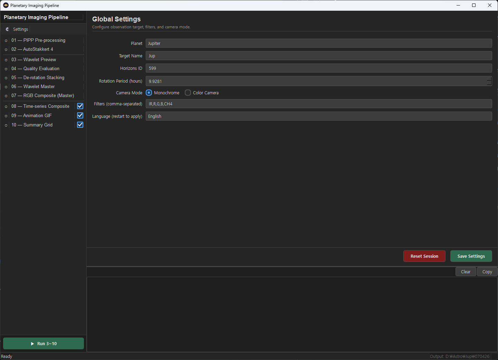
*Figure 3-1: Global Settings panel*

Global settings define the base values that affect the entire pipeline. Always review these before starting a session.

### 3.1 Planet Presets

| Preset | Target Name | Horizons ID | Rotation Period |
|--------|-------------|-------------|-----------------|
| **Jupiter** | Jup | 599 | 9.9281 h |
| **Saturn** | Sat | 699 | 10.56 h |
| **Mars** | Mar | 499 | 24.6229 h |
| **Uranus** | Ura | 799 | 17.24 h |
| **Neptune** | Nep | 899 | 16.11 h |
| **Mercury** | Mer | 199 | 1407.6 h |
| **Venus** | Ven | 299 | 5832.5 h |
| **Custom** | User input | User input | User input |

Selecting a preset automatically fills in the fields below.

### 3.2 Parameter Details

| Parameter | Default | Description |
|-----------|---------|-------------|
| **Planet Preset** | Jupiter | Select the target planet. When Custom is selected, the three fields below must be entered manually. |
| **Target Name** | Jup | Short identifier used in filenames and logs within the pipeline. |
| **Horizons ID** | 599 | NASA JPL Horizons service body ID. Used by Step 05 de-rotation to automatically fetch the planet's north pole angle (NP.ang) for the observation date. |
| **Rotation Period (h)** | 9.9281 | The planet's rotation period in hours. This is the basis for de-rotation calculations in Step 05. |
| **Camera Mode** | Mono | **Mono**: Uses a filter wheel, separate SER files per filter. **Color**: Single color camera. Selecting Color automatically sets the filter list to `COLOR` and disables editing. |
| **Filter List** | IR,R,G,B,CH4 | Comma-separated list of filters used. This list populates the channel dropdowns in Step 07 compositing. Automatically set to `COLOR` when Color camera mode is selected. |
| **Language** | ko | Interface language. Changes take effect after restarting the application. |

> **Tip**: Settings are saved per session. When you reopen the tool, your previous configuration is automatically restored.

---

## 4. Step 01 — PIPP Preprocessing

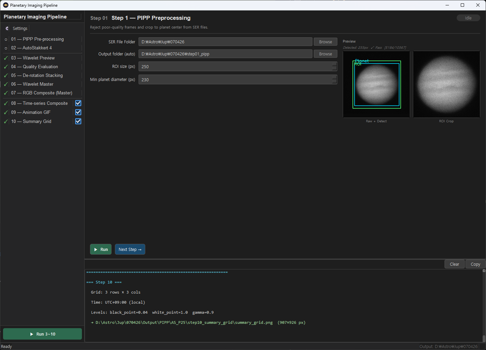
*Figure 4-1: Step 01 panel — Left: form, Right: SER frame preview*

Uses PIPP (Planetary Imaging PreProcessor) to crop SER videos centered on the planet and extract the Region of Interest (ROI).

> **Optional Step**: This step can be skipped if your SER files are already cropped or if you've run PIPP separately.

### 4.1 Parameters

| Parameter | Default | Range | Description |
|-----------|---------|-------|-------------|
| **SER Video Folder** | (Required) | — | Path to the folder containing SER files. Automatically searches all subfolders for `.SER` files. Browse with the `...` button or type the path directly. |
| **Output Folder** | Auto-set | — | Folder where PIPP-processed SER files will be saved. |
| **ROI Size (px)** | 448 | 64–1024 (step 16) | Square crop size for PIPP output. Set this large enough to encompass the planetary disc. 448–512px is typical for Jupiter. |
| **Min Disc Diameter (px)** | 50 | 10–500 (step 5) | Minimum disc size to be considered a valid planet detection. Frames where the detected disc is smaller than this value are discarded as bad frames. |

### 4.2 Live Preview

The right panel shows a live preview.

- **Cyan box (Planet)**: Automatically detected planet region
- **Green box (ROI)**: The area that will be cropped to the set ROI size

The preview automatically refreshes when ROI size or minimum diameter changes.

---

## 5. Step 02 — AutoStakkert!4

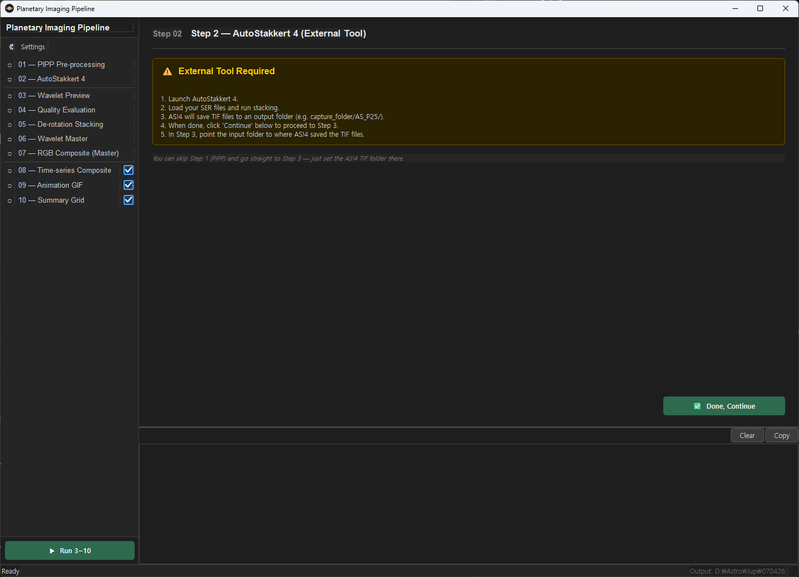
*Figure 5-1: Step 02 panel — AutoStakkert!4 manual execution guide*

AutoStakkert!4 is an external program that cannot be executed directly by the pipeline. This step is an informational panel guiding you on how to run AS!4.

> **Optional Step**: Skip this step if AS!4 stacking is already complete.

### How to Proceed

1. Follow the instructions in this panel and **run AutoStakkert!4 separately**.
2. Use Step 01's output folder (PIPP-processed SER files) as the AS!4 input.
3. Once AS!4 stacking is complete, click **"Done, Continue"** to proceed to the next step.

The path to AS!4's output TIF files is specified directly in Step 03.

---

## 6. Step 03 — Wavelet Preview Sharpening

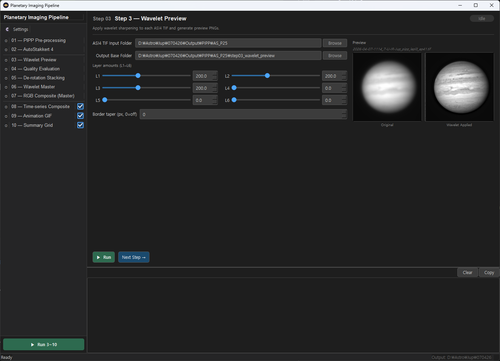
*Figure 6-1: Step 03 panel — Wavelet sharpening configuration*

Applies wavelet sharpening to TIF files output by AutoStakkert!4 and converts them to PNG format. These PNGs are used as input for Step 04 quality assessment and as the source data for Step 08 time-series compositing.

> **Required Step**: This step cannot be skipped.

### 6.1 Parameters

| Parameter | Default | Range | Description |
|-----------|---------|-------|-------------|
| **AS!4 TIF Folder** | (Required) | — | The folder where AutoStakkert!4 saved TIF files. Processes all `.tif` / `.TIF` files in this folder. |
| **Output Base Folder** | (Required) | — | Parent folder where all step results are saved. Input/output folders for Steps 03 and beyond are automatically configured under this directory. |
| **Border Taper (px)** | 0 | 0–100 (step 5) | Applies a soft fade to image edges. 0 = disabled (recommended). |

### 6.2 Wavelet Levels (L1–L6)

| Level | Default | Range | Characteristics |
|-------|---------|-------|-----------------|
| **L1** | 200 | 0–500 | Finest detail (pixel-level sharpening) |
| **L2** | 200 | 0–500 | Fine detail |
| **L3** | 200 | 0–500 | Medium detail |
| **L4** | 0 | 0–500 | Large-scale structures (risk of noise amplification) |
| **L5** | 0 | 0–500 | Even larger structures |
| **L6** | 0 | 0–500 | Largest structures |

- Sliders and number inputs are **bidirectionally synchronized**.
- It is recommended to **only activate L1–L3** for planetary imaging. L4 and above can excessively amplify noise.
- These values apply only to the preview sharpening in Step 03. Final master image sharpening is configured separately in Step 06.

---

## 7. Step 04 — Quality Assessment & Window Detection

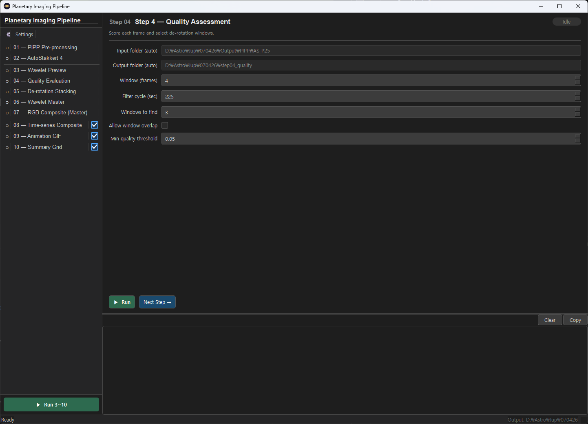
*Figure 7-1: Step 04 panel — Quality assessment configuration*

Automatically evaluates the image quality of each TIF frame and detects the optimal time window for stacking.

> **Required Step**: This step cannot be skipped.

### 7.1 Parameters

| Parameter | Default | Range | Description |
|-----------|---------|-------|-------------|
| **Input Folder** | Auto-set | — | Automatically set to the same AS!4 TIF folder as Step 03. |
| **Output Folder** | Auto-set | — | Quality score CSVs and window recommendation JSON are saved here. |
| **Window (frames)** | 3 | 1–20 | De-rotation window length expressed as **number of filter cycles**. 1 frame = one complete filter cycle (IR→R→G→B→CH4). Actual window time = frames × filter cycle time. Example: 3 frames × 225s = 675s (~11 min). **Jupiter: 2–4 frames / Mars, Saturn: 3–6 frames** |
| **Filter cycle (sec)** | 225 | 10–600 (step 15) | Time in seconds for one complete filter cycle (IR→R→G→B→CH4→IR). Set this to match your actual capture cadence. Example: 45s × 5 filters = 225s. **This value is used only for Step 04 window length calculation.** Step 08 has its own independent cycle time setting. |
| **Number of Windows** | 1 | 1–10 | Number of optimal windows to detect. **1**: Find only the single best window (for Step 05 stacking). **2–3**: Detect multiple windows at different epochs (for Step 08 time-series). |
| **Allow Overlap** | Off | — | Checked: Detected windows may overlap in time. Unchecked: Each window is non-overlapping (default). |
| **Min Quality Threshold** | 0.05 | 0.0–1.0 (step 0.05) | Frames below this quality score are excluded from window optimization. 0.0 = include all frames. 0.2–0.3 = remove clearly bad frames. **Setting too high may leave too few valid frames.** |

> **Color camera mode**: The "Filter cycle (sec)" label changes to **"Single frame interval (sec)"** with a default of 45s. In this case, 1 frame = the time to capture one color frame.

### 7.2 Output Files

- `{filter}_ranking.csv`: Quality score list per TIF file for each filter
- `windows.json`: Detected optimal time window information
- `windows_summary.txt`: Human-readable window summary

---

## 8. Step 05 — De-rotation Stacking

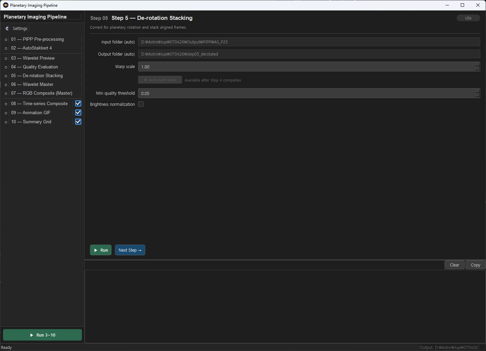
*Figure 8-1: Step 05 panel — De-rotation stacking configuration*

Stacks frames within the optimal windows detected in Step 04, correcting for planetary rotation during the process.

> **Required Step**: This step cannot be skipped.

### 8.1 Parameters

| Parameter | Default | Range | Description |
|-----------|---------|-------|-------------|
| **Input Folder** | Auto-set | — | Automatically set to the same AS!4 TIF folder as Step 04. |
| **Output Folder** | Auto-set | — | De-rotation stacked master TIF files are saved here. |
| **Warp Scale** | 0.80 | 0.0–2.0 (step 0.01) | Spherical distortion correction strength. Because a planet is a sphere, the disc centre moves significantly with rotation while the limb barely moves. Warp scale controls the magnitude of this depth-dependent per-pixel correction. **0.0** = no correction (uniform shift), **1.0** = theoretical full sphere correction, **0.80** = recommended for Jupiter in typical seeing. On nights of exceptional seeing, try 1.0–1.2. |
| **Min Quality Threshold** | 0.05 | 0.0–1.0 (step 0.05) | Frames below this quality score are excluded from stacking. Raise to 0.3–0.5 when seeing conditions are poor to more strictly filter bad frames. |
| **Normalize Brightness** | Off | — | Normalizes the brightness of each frame before stacking. Enable when frames have significant brightness variations due to changing seeing conditions. |

### 8.2 Warp Scale Auto-Tune

<!-- TODO: Insert Step 05 panel screenshot (auto-tune button highlighted) -->

The **"▶ Auto-tune scale"** button inside the panel sweeps warp scale values and automatically finds the value that maximises stack sharpness (Laplacian variance), based on Step 04 data.

- Only becomes active after Step 04 has been run.
- Takes approximately 2–4 seconds.
- Results are shown in orange (low confidence, improvement < 3%) or green (high confidence).
- The auto-tuned value is a starting point — manual fine-tuning afterwards is recommended.

### 8.3 JPL Horizons Integration

Step 05 automatically queries the NASA JPL Horizons API to retrieve the planet's north pole angle (NP.ang) at the time of observation. The **Horizons ID** in Global Settings must be set correctly. An internet connection is required.

---

## 9. Step 06 — Wavelet Master Sharpening

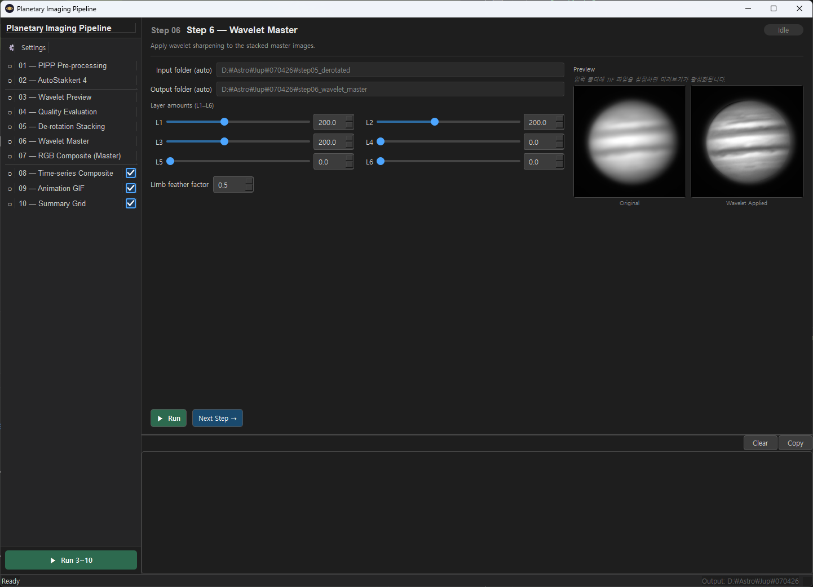
*Figure 9-1: Step 06 panel — Master image wavelet sharpening (Left: controls, Right: live preview)*

Applies wavelet sharpening to the master TIF images generated by Step 05. Since master images result from stacking thousands of frames, their SNR is extremely high, allowing stronger sharpening than Step 03.

> **Required Step**: This step cannot be skipped.

### 9.1 Wavelet Levels (L1–L6)

Same structure as Step 03, but **stronger values can be safely used** since it's applied to master images.

| Level | Default | Recommended Range | Characteristics |
|-------|---------|-------------------|-----------------|
| **L1** | 200 | 100–400 | Highest-resolution pixel-level detail |
| **L2** | 200 | 100–400 | Fine structures (belts, streaks) |
| **L3** | 200 | 50–300 | Medium-scale structures |
| **L4** | 0 | 0–100 | Large-scale tonal contrast |
| **L5** | 0 | 0 | Not recommended |
| **L6** | 0 | 0 | Not recommended |

### 9.2 Limb Feather Factor (edge_feather_factor)

| Parameter | Default | Range | Description |
|-----------|---------|-------|-------------|
| **Limb feather factor** | 2.0 | 0.0–8.0 (step 0.5) | Controls the width of the wavelet attenuation zone near the disc limb. Feather width at level L = 2^L × factor (px). **0.0** = no feathering (full sharpening to the limb, ringing risk), **2.0** = default (recommended), **8.0** = wide feather (some attenuation inside the disc). **Applies only to Step 06 master sharpening.** Step 08 time-series frame feathering is set independently in the Step 08 panel. |

### 9.3 Live Preview

The right panel shows a live wavelet sharpening preview that refreshes automatically as you adjust the sliders.

> **Tip**: Master images have very high SNR, so raising L1 and L2 to 300–400 rarely produces artifacts. Tune Step 03 and Step 06 values independently for optimal results.

---

## 10. Step 07 — RGB Composite (Master)


Combines per-filter master PNGs from Step 06 into color images.

> **Required Step**: This step cannot be skipped.

The UI differs completely depending on camera mode.

---

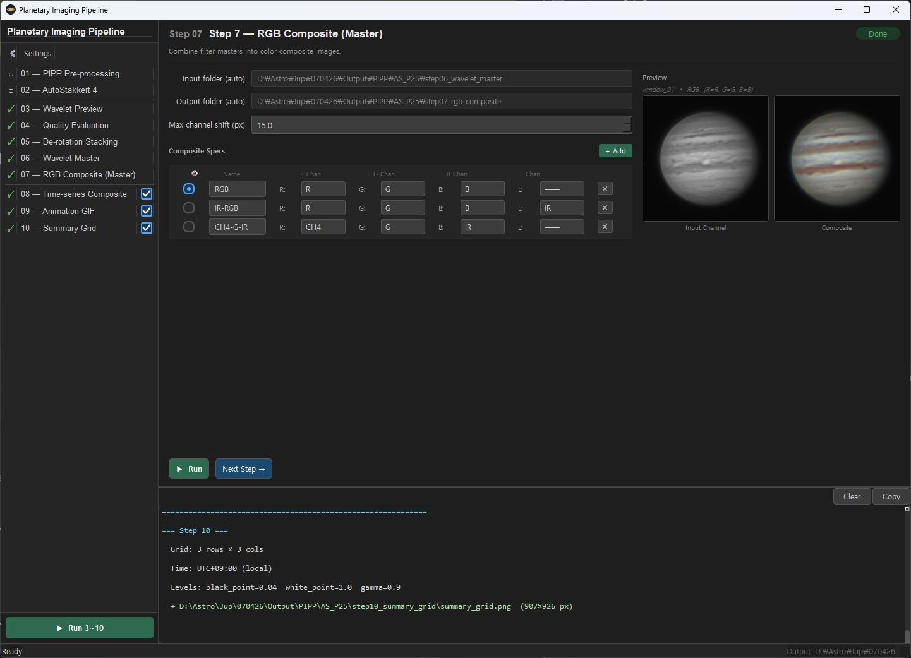
*Figure 10-1: Step 07 panel — RGB composite settings with live preview*


### 10.A Mono Camera Mode

Multiple composite types (RGB, LRGB, false color) can be defined and produced in a single session.

#### 10.A.1 Base Parameters

| Parameter | Default | Range | Description |
|-----------|---------|-------|-------------|
| **Max Channel Shift (px)** | 15.0 | 0.0–100.0 | Maximum allowed shift in channel-to-channel phase correlation alignment. If the computed shift exceeds this value, alignment is skipped (prevents runaway misalignment). Raise to 20–30 on nights with strong atmospheric dispersion. |

#### 10.A.2 Composite Specification Table

Each row defines one composite output image.

| Column | Description |
|--------|-------------|
| **👁 (Radio Button)** | Selects which composite to display in the preview. Only one can be selected at a time. |
| **Name** | The name of the composite image. Used in the output filename (e.g., `RGB_composite.png`). |
| **R Channel** | Filter assigned to the red channel. |
| **G Channel** | Filter assigned to the green channel. |
| **B Channel** | Filter assigned to the blue channel. |
| **L Channel** | Filter assigned as luminance channel. Selecting this enables **LRGB compositing** mode. `──` = not used (plain RGB). |
| **✕** | Deletes this composite specification row. |

#### Default Composite Specs

| Name | R | G | B | L | Description |
|------|---|---|---|---|-------------|
| **RGB** | R | G | B | (none) | Standard 3-color composite |
| **IR-RGB** | R | G | B | IR | LRGB using IR as luminance. The IR channel's high resolution enhances fine luminance detail. |
| **CH4-G-IR** | CH4 | G | IR | (none) | Methane band false-color composite. Emphasizes Jupiter's cloud structure and the GRS. |

Use the **+ Add** button to add new composite specs with any filter combination you need.

#### 10.A.3 Live Preview

The right panel shows a live preview of the currently selected (radio button) composite. The preview refreshes automatically 400ms after changing any R/G/B/L dropdown.

> **Note**: The preview is computed without channel alignment (phase correlation) for speed. Alignment effects can be verified in the output files after running the step.

---

### 10.B Color Camera Mode

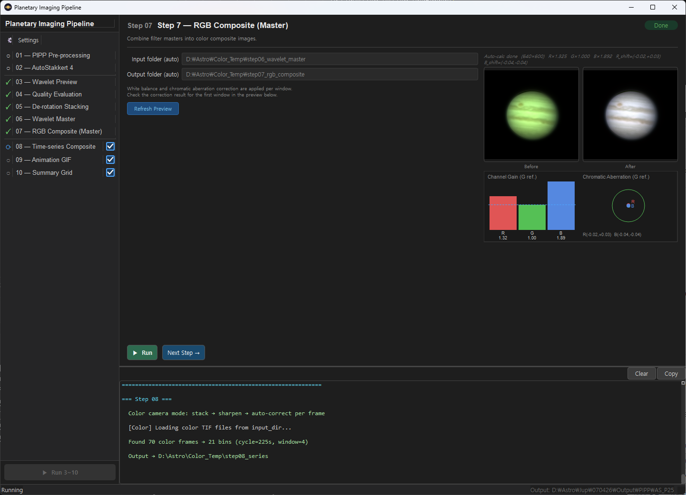
*Figure 10-2: Step 07 color camera mode — Auto white balance + CA correction preview*

In color camera mode, **automatic white balance (WB) + chromatic aberration (CA) correction** is applied automatically by the pipeline instead of manual channel assignment.

- **No configuration needed**: All corrections are determined algorithmically, computed independently per window.
- **"Refresh Preview" button**: Loads a Step 06 PNG and shows the auto-correction result.
- **Before/After panels**: Side-by-side comparison of the original and corrected images.
- **Channel gain graph**: Visualises the R/G/B gain (WB) and R/B channel shift (CA correction).

---

## 11. Step 08 — Time-Series RGB Composite

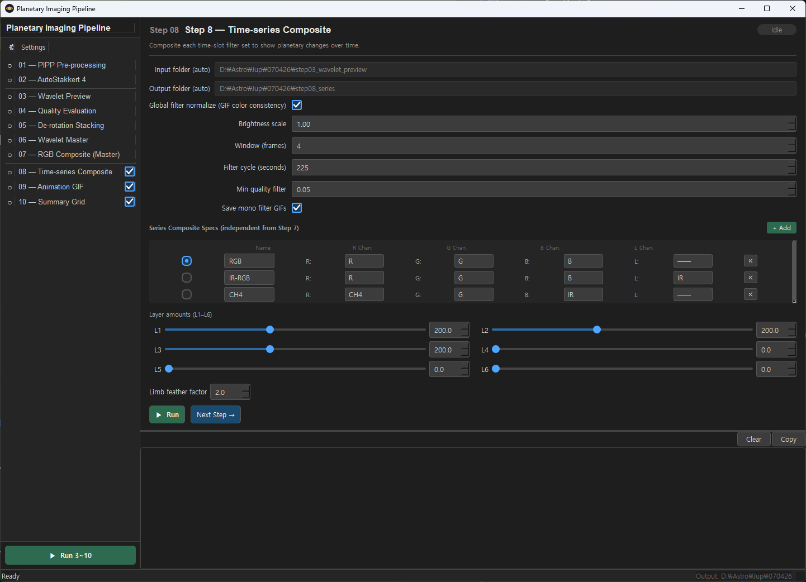
*Figure 11-1: Step 08 panel — Time-series composite settings*

Uses **wavelet preview PNGs from Step 03** to create time-series RGB composite images at different epochs. Used for planetary rotation time-series analysis and GIF animation.

> **Optional Step**: Skip if time-series compositing is not needed.

> **Important**: Step 08 uses its **own independent composite specs** — it does not re-use Step 07 settings. It composites directly from Step 03 PNGs, not from Step 07 output.

The parameters shown differ depending on camera mode.

---

### 11.A Mono Camera Mode

#### 11.A.1 Parameters

| Parameter | Default | Range | Description |
|-----------|---------|-------|-------------|
| **Global filter normalize** | On | — | Unifies the brightness range of each filter across all frames. Greatly reduces colour inconsistency between frames in Step 09 GIFs. **Recommended when using Step 09.** |
| **Brightness scale** | 1.00 | 0.1–1.0 (step 0.05) | Multiplier applied to composite brightness. 1.0 = unchanged, 0.80 = 80% brightness. |
| **Window (frames)** | 3 | 1–9 (odd recommended) | Sliding-window stacking frame count. 1 = single frame, 3 = ±1 frame (SNR ×√3), 5 = ±2 frames (SNR ×√5). Recommended upper limit for Jupiter: 5 frames (~20 min). |
| **Filter cycle (seconds)** | 225 | 10–600 (step 15) | Time for one complete filter cycle (IR→R→G→B→CH4→IR). Used to group Step 03 PNGs into per-epoch time-series sets. **Set independently from Step 04's filter cycle time.** |
| **Min quality filter** | 0.05 | 0.0–0.9 (step 0.05) | Quality filter for frames (0.0 = no filter). Low-quality frames receive reduced weighting (soft down-weighting, not hard exclusion). |
| **Save mono filter GIFs** | Off | — | When checked: saves each filter's monochrome frames alongside the color composites. Step 09 will also generate per-filter monochrome GIFs. |

#### 11.A.2 Wavelet Sharpening (Series)

Independent wavelet sharpening settings applied to each time-series frame. Separate from Step 06.

| Level | Default | Description |
|-------|---------|-------------|
| L1–L6 | [200, 200, 200, 0, 0, 0] | Same structure as Step 06. Applied only to time-series frames. |
| **Limb feather factor** | 2.0 | Set independently from Step 06's `edge_feather_factor`. |

#### 11.A.3 Series Composite Specs (Independent from Step 7)

Defines composite channels specifically for the time-series, **independently of Step 07's composite specs**. The table structure is identical to Step 07 (Name, R/G/B/L channels, delete button).

Default specs: RGB, IR-RGB, CH4-G-IR (same as Step 07 defaults)

---

### 11.B Color Camera Mode

<!-- TODO: Insert Step 08 color mode panel screenshot -->

In color camera mode, continuous COLOR channel frames are stacked using a sliding window.

| Parameter | Default | Range | Description |
|-----------|---------|-------|-------------|
| **Brightness scale** | 1.00 | 0.1–1.0 (step 0.05) | Same as mono mode. |
| **Capture interval (sec)** | 30 | 5–300 (step 5) | Continuous color capture interval in seconds. Unlike the mono "filter cycle", this is the time between individual color frames. |
| **Window (frames)** | 5 | 1–99 (odd recommended) | Sliding-window stacking frame count. Color cameras capture faster, so larger values are practical. |
| **Min quality filter** | 0.05 | 0.0–0.9 (step 0.05) | Same as mono mode. |
| **Wavelet sharpening** | [200, 200, 200, 0, 0, 0] | — | Wavelet sharpening applied after stacking. |

Processing order: sliding-window stacking → wavelet sharpening → auto WB + CA correction

---

## 12. Step 09 — Animated GIF

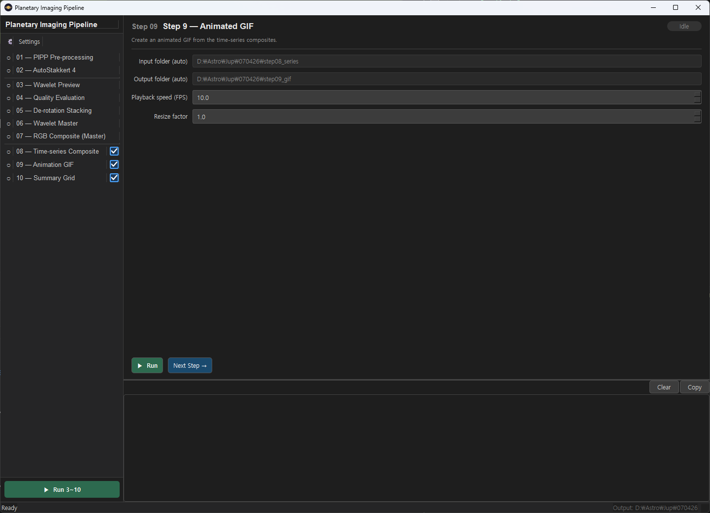
*Figure 12-1: Step 09 panel — GIF animation configuration*

Combines the time-series composite results from Step 08 into a planetary rotation animation GIF.

> **Optional Step**: Only available when Step 08 has been run.

### 12.1 Parameters

| Parameter | Default | Range | Description |
|-----------|---------|-------|-------------|
| **Input Folder** | Auto-set | — | Automatically set to the Step 08 time-series PNG folder. |
| **Output Folder** | Auto-set | — | GIF file is saved here. |
| **FPS** | 6.0 | 1.0–30.0 (step 0.5) | GIF playback speed in frames per second. 6–10 FPS is typical for planetary rotation animations. |
| **Resize Factor** | 1.0 | 0.1–2.0 (step 0.1) | Output GIF size multiplier. 1.0 = original size, 0.5 = half size (reduces file size). |

---

## 13. Step 10 — Summary Grid

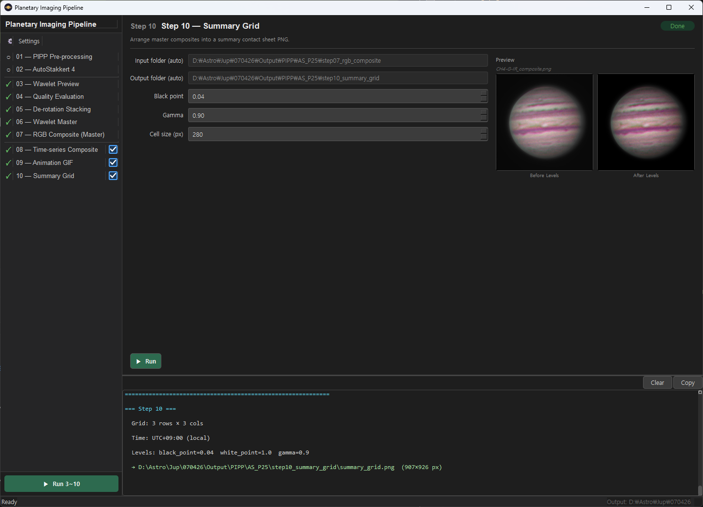
*Figure 13-1: Step 10 panel — Summary grid with levels adjustment (Left: controls, Right: live preview)*

Applies levels correction to Step 07 RGB composite results and combines them into a single summary grid image. Used for generating final images for observation reports or forum posts.

> **Optional Step**: Use only when needed.

### 13.1 Parameters

| Parameter | Default | Range | Description |
|-----------|---------|-------|-------------|
| **Input Folder** | Auto-set | — | Automatically set to the Step 07 RGB composite result folder. |
| **Output Folder** | Auto-set | — | Summary grid PNG is saved here. |
| **Black Point** | 0.04 | 0.0–0.5 (step 0.01) | Pixels at or below this value are remapped to pure black (0). Suppresses background sky noise and gives the planet a clean dark border. Recommended range: **0.02–0.08**. |
| **Gamma** | 0.9 | 0.1–3.0 (step 0.05) | Brightness gamma correction. **1.0** = no correction / **< 1.0** = brighter (typically 0.8–1.0 recommended) / **> 1.0** = darker. |
| **Cell Size (px)** | 300 | 100–1024 (step 50) | Size in pixels of each composite image cell within the summary grid. |

### 13.2 Live Preview

The right panel shows before/after levels adjustment previews. The preview automatically refreshes 400ms after changing any parameter.

---

## 14. Run All


*Figure 14-1: Pipeline running state*

Clicking the **"▶ Run 3~10"** button in the left sidebar automatically runs Steps 03 through 10 in sequence.

- Steps 01 and 02 are excluded from automatic execution as they depend on external tools (PIPP, AS!4).
- If an error occurs during execution, the pipeline halts at that step and an error message is printed to the log.

---

## 15. Output Folder Structure

After pipeline execution, the following folders are created under the output base folder (e.g., `260402_output/`):

```
{output_base}/
├── step03_wavelet_preview/     # Step 03: Wavelet-processed preview PNGs
│   ├── 2026-03-20-1046_1-U-IR-Jup_..._wavelet.png
│   └── ...
├── step04_quality/             # Step 04: Quality assessment results
│   ├── {filter}_ranking.csv
│   ├── windows.json
│   └── windows_summary.txt
├── step05_derotated/           # Step 05: De-rotation master TIFs
│   └── window_01/
│       ├── IR_master.tif
│       ├── R_master.tif
│       └── ...
├── step06_wavelet_master/      # Step 06: Wavelet master PNGs
│   └── window_01/
│       ├── IR_master.png
│       ├── R_master.png
│       └── ...
├── step07_rgb_composite/       # Step 07: RGB composite PNGs
│   └── window_01/
│       ├── RGB_composite.png
│       ├── IR-RGB_composite.png
│       ├── CH4-G-IR_composite.png
│       └── ...
├── step08_series/              # Step 08: Time-series composite PNGs
│   ├── 2026-03-20T10:46_RGB.png
│   └── ...
├── step09_gif/                 # Step 09: Animated GIF
│   └── RGB_animation.gif
└── step10_summary_grid/        # Step 10: Summary grid PNG
    └── summary_grid.png
```