# PlanetFlow — 사용자 가이드

---

## 목차

1. [개요](#1-개요)
2. [메인 화면 구성](#2-메인-화면-구성)
3. [전역 설정 (Settings)](#3-전역-설정-settings)
4. [Step 01 — SER Crop](#4-step-01--ser-crop)
5. [Step 02 — Lucky Stacking](#5-step-02--lucky-stacking)
6. [Step 03 — 품질 평가 및 윈도우 탐지](#6-step-03--품질-평가-및-윈도우-탐지)
7. [Step 04 — De-rotation 스태킹](#7-step-04--de-rotation-스태킹)
8. [Step 05 — Wavelet 마스터 선명화](#8-step-05--wavelet-마스터-선명화)
9. [Step 06 — RGB 합성 (마스터)](#9-step-06--rgb-합성-마스터)
10. [Step 07 — Wavelet 미리보기](#10-step-07--wavelet-미리보기)
11. [Step 08 — 애니메이션 GIF](#11-step-08--애니메이션-gif)
12. [Step 09 — 요약 그리드](#12-step-09--요약-그리드)
13. [전체 실행 (Run All)](#13-전체-실행-run-all)
14. [출력 폴더 구조](#14-출력-폴더-구조)

---

## 1. 개요

이 도구는 행성 고해상도 촬영 후처리 과정을 자동화하는 GUI 파이프라인입니다. SER 동영상 촬영부터 시작하여, SER Crop → Lucky Stacking → 품질 평가 → de-rotation 스태킹 → 웨이블릿 선명화 → RGB 합성 → 애니메이션 GIF → 요약 그리드 생성까지 전 과정을 GUI에서 단계별로 자동화합니다.

### 1.1 카메라 모드

이 파이프라인은 두 가지 카메라 모드를 지원합니다.

| 모드 | 설명 | 필터 구성 |
|------|------|-----------|
| **모노 (Mono)** | 필터 휠을 사용하는 흑백 카메라. 필터별 SER 파일 촬영. | IR, R, G, B, CH4 등 다중 필터 |
| **컬러 (Color)** | 단일 컬러(베이어) 카메라. 필터 전환 없이 연속 촬영. | COLOR (단일 채널) |

전역 설정에서 카메라 모드를 선택하면 Step 03, 06의 UI와 파라미터가 자동으로 전환됩니다.

### 1.2 전체 워크플로우

```
촬영 SER 파일
     │
     ▼
[Step 01] SER Crop           ← SER → 크롭된 SER (선택)
     │
     ▼
[Step 02] Lucky Stacking     ← SER → TIF 스태킹 (선택)
     │
     │    ├──→ [Step 07] Wavelet 미리보기  ← TIF → 선명화 PNG (선택)
     │
     ▼
[Step 03] 품질 평가          ← 슬라이딩 윈도우 전체 시계열 열거 (필수)
     │
     ▼
[Step 04] De-rotation 스태킹 ← 자전 보정 + 스태킹 (필수)
     │
     ▼
[Step 05] Wavelet 마스터     ← 마스터 이미지 선명화 (필수)
     │
     ▼
[Step 06] RGB 합성 (마스터)  ← 필터 채널 합성 (필수)
     │
     ├──→ [Step 08] 애니메이션 GIF   ← Step 06 출력 기반 자전 애니메이션 (선택)
     │
     └──→ [Step 09] 요약 그리드  (선택)
```

---

## 2. 메인 화면 구성
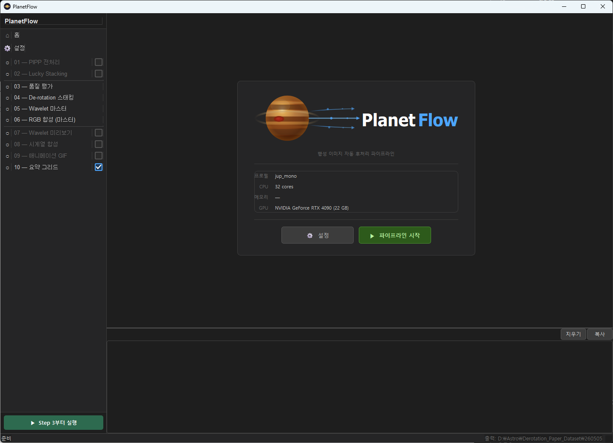

### 2.1 좌측 사이드바

화면 좌측에는 단계 목록이 있습니다.

| 구성 요소 | 설명 |
|-----------|------|
| **⌂ 홈 (Home)** | 시작 화면으로 돌아갑니다. 활성 프로필, CPU 코어 수, RAM, GPU 정보가 표시됩니다. |
| **⚙ Settings** | 전역 설정 패널로 이동합니다. 행성 프리셋, 카메라 모드, 필터 구성 및 프로필을 관리합니다. |
| **단계 목록** | Step 01 ~ Step 09를 클릭하여 해당 패널로 이동합니다. |
| **선택적 (Optional)** | 별도 표시된 단계는 건너뛸 수 있습니다. (Step 01, 02, 07, 08, 09) |

### 2.2 우측 메인 영역

| 구성 요소 | 설명 |
|-----------|------|
| **패널 영역** | 선택한 단계의 설정 화면이 표시됩니다. |
| **로그 영역** | 하단에 파이프라인 실행 로그가 출력됩니다. |

### 2.3 공통 버튼

각 단계 패널 하단에는 다음 버튼들이 있습니다.

| 버튼 | 설명 |
|------|------|
| **▶ 실행** | 현재 단계만 실행합니다. |
| **⏹ 중단** | 실행 중일 때 나타납니다. 모든 활성 스레드에 취소 신호를 전달합니다. 즉시 **"중단 중..."** 으로 바뀌고, 모든 스레드가 실제로 종료되면 **"중단됨 ✓"** (초록 테두리)로 변경됩니다. 2.5초 후 자동으로 초기 상태로 돌아옵니다. |
| **다음 단계 →** | 실행 후 자동으로 다음 단계 패널로 이동합니다. Step 09에는 없습니다. |

---

## 3. 전역 설정 (Settings)
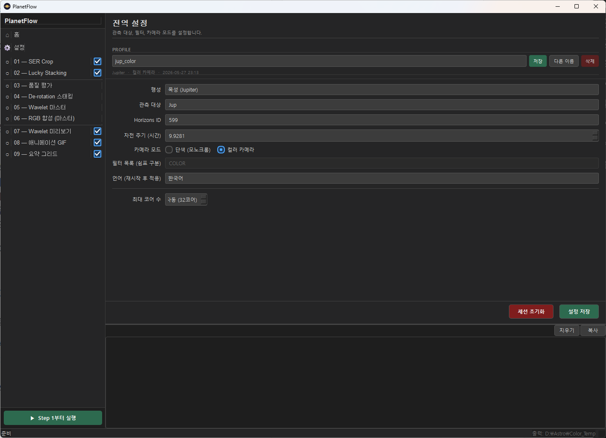

전역 설정은 파이프라인 전체에 영향을 미치는 기본 값을 정의합니다. 작업 시작 전 반드시 확인하세요.

### 3.1 행성 프리셋

| 프리셋 | 목표명 | Horizons ID | 자전 주기 |
|--------|--------|-------------|-----------|
| **Jupiter** | Jup | 599 | 9.9281 h |
| **Saturn** | Sat | 699 | 10.56 h |
| **Mars** | Mar | 499 | 24.6229 h |
| **Uranus** | Ura | 799 | 17.24 h |
| **Neptune** | Nep | 899 | 16.11 h |
| **Mercury** | Mer | 199 | 1407.6 h |
| **Venus** | Ven | 299 | 5832.5 h |
| **Custom** | 직접 입력 | 직접 입력 | 직접 입력 |

프리셋을 선택하면 아래 필드가 자동으로 채워집니다.

### 3.2 파라미터 상세

| 파라미터 | 기본값 | 설명 |
|----------|--------|------|
| **행성 프리셋** | Jupiter | 목표 행성을 선택합니다. Custom 선택 시 아래 세 필드를 직접 입력합니다. |
| **목표명 (Target)** | Jup | 파이프라인 내부에서 파일명과 로그에 사용되는 짧은 식별자입니다. |
| **Horizons ID** | 599 | NASA JPL Horizons 서비스의 천체 ID입니다. Step 04 de-rotation에서 북극 방향각(NP.ang)을 자동 조회할 때 사용합니다. |
| **자전 주기 (h)** | 9.9281 | 행성의 자전 주기(시간)입니다. Step 04에서 자전 보정 계산의 기준이 됩니다. |
| **카메라 모드** | Mono | **Mono**: 필터 휠 사용, 필터별 SER 파일. **Color**: 단일 컬러 카메라. 컬러 선택 시 필터 목록이 `COLOR`로 자동 설정됩니다. |
| **필터 목록** | IR,R,G,B,CH4 | 사용하는 필터를 쉼표로 구분하여 입력합니다. 이 목록이 Step 06 합성 설정의 드롭다운 항목이 됩니다. 컬러 카메라 선택 시 자동으로 `COLOR`로 설정되고 편집이 비활성화됩니다. |
| **언어** | en | 인터페이스 언어를 선택합니다. 변경 즉시 패널이 재구성되어 적용됩니다. |

> **팁**: 촬영 세션별로 설정이 세션 파일에 저장됩니다. 다음에 도구를 열면 이전 설정이 자동 복원됩니다.

### 3.3 프로필 관리

프로필을 사용하면 이름 있는 세션 설정(행성, 장비, 필터 조합 등)을 저장하고 빠르게 전환할 수 있습니다.

| 버튼 | 설명 |
|------|------|
| **프로필 드롭다운** | 저장된 프로필을 선택하여 불러옵니다. *(저장되지 않음)* 상태는 현재 세션이 아직 프로필로 저장되지 않았음을 의미합니다. |
| **저장** | 현재 설정을 활성 프로필에 덮어씁니다. |
| **다른 이름** | 현재 설정을 새 이름의 프로필로 저장하고 해당 프로필로 전환합니다. |
| **삭제** | 활성 프로필을 삭제하고 *(저장되지 않음)* 상태로 되돌립니다. |

세션을 저장할 때마다 활성 프로필(있는 경우)도 자동으로 함께 업데이트됩니다.

---

## 4. Step 01 — SER Crop
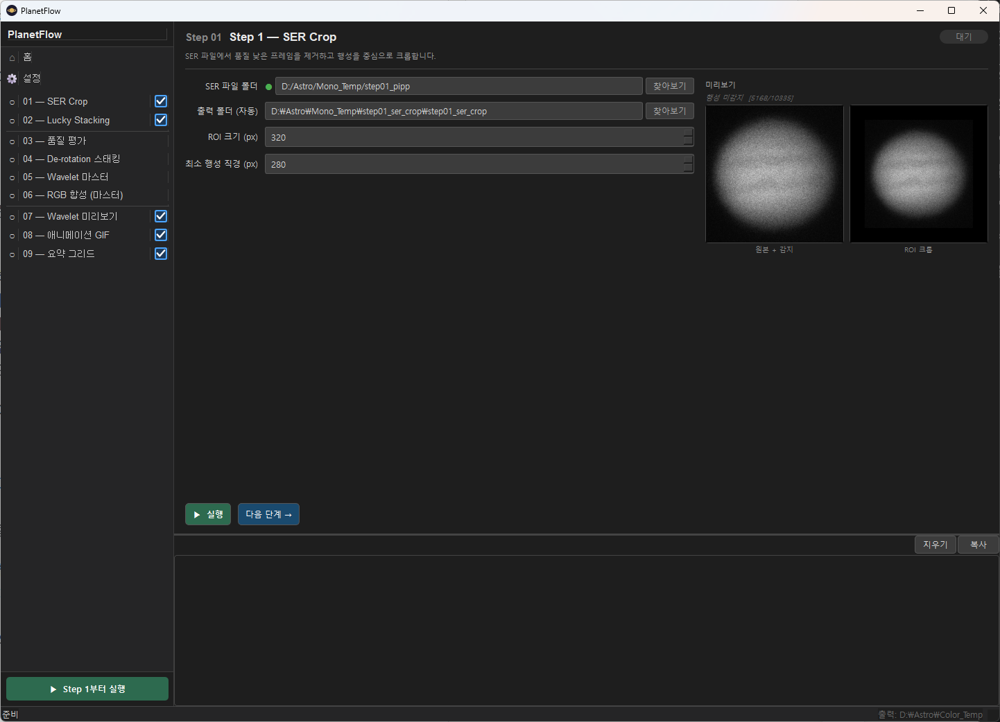

내장 SER Crop 전처리: SER 영상을 행성 중심으로 크롭하고 ROI(Region of Interest)를 추출합니다.

> **선택적 단계**: SER 파일이 이미 크롭되어 있다면 이 단계를 건너뛸 수 있습니다.

### 4.1 파라미터

| 파라미터 | 기본값 | 범위 | 설명 |
|----------|--------|------|------|
| **SER 영상 폴더** | (필수 입력) | — | SER 파일이 있는 촬영 폴더 경로입니다. 하위 폴더를 포함하여 모든 `.SER` 파일을 자동으로 찾습니다. 우측 `...` 버튼으로 탐색하거나 직접 경로를 입력하세요. |
| **출력 폴더** | 자동 설정 | — | SER Crop 처리된 SER 파일이 저장될 폴더입니다. |
| **ROI 크기 (px)** | 448 | 64–1024 (16 단위) | SER Crop 출력 이미지의 정사각형 크롭 크기입니다. 행성 원반보다 충분히 크게 설정하세요. |
| **최소 원반 지름 (px)** | 50 | 10–500 (5 단위) | 유효한 행성으로 인정할 최소 원반 크기입니다. 이보다 작은 원반이 감지된 프레임은 불량 프레임으로 제거됩니다. |

### 4.2 실시간 미리보기

오른쪽 패널에 미리보기가 표시됩니다.

- **청록색 상자 (Planet)**: 자동 감지된 행성 영역
- **초록 상자 (ROI)**: 설정된 ROI 크기로 크롭될 영역

ROI 크기나 최소 원반 지름을 변경하면 미리보기가 자동으로 갱신됩니다.

---

## 5. Step 02 — Lucky Stacking
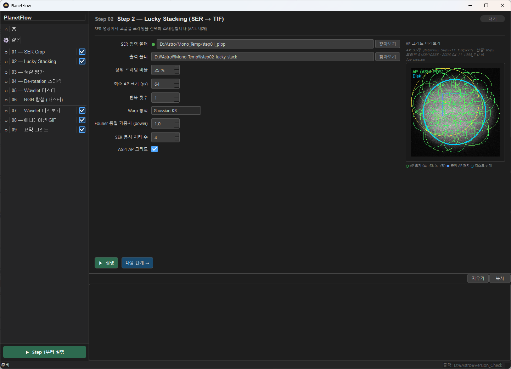

SER 파일에서 상위 프레임을 선별하고 **AP별 독립 패치 스태킹**으로 TIF 파일을 생성합니다. 외부 프로그램 없이 파이프라인 내부에서 자동으로 처리됩니다. Step 01이 활성화된 경우 Step 01의 SER 출력 폴더가 자동으로 연결됩니다.

> **선택적 단계**: 외부 도구로 TIF 스택이 이미 생성되어 있는 경우 건너뛰고 Step 03에서 해당 폴더를 직접 지정할 수 있습니다.

### 5.1 파라미터

| 파라미터 | 기본값 | 범위 | 설명 |
|----------|--------|------|------|
| **SER 입력 폴더** | (필수 입력) | — | Lucky Stacking할 SER 파일이 있는 폴더입니다. Step 01이 활성화된 경우 Step 01의 출력 폴더가 자동으로 연결됩니다. `...` 버튼으로 탐색하거나 직접 경로를 입력하세요. |
| **출력 폴더** | 자동 설정 | — | Lucky Stacking 결과 TIF 파일이 저장될 폴더입니다. SER 입력 폴더 기준으로 `step02_lucky_stack`이 자동 설정됩니다. |
| **상위 프레임 비율** | 25 % | 5–100 % (5 단위) | 품질 점수 상위 N%의 프레임만 스태킹에 사용합니다. 낮은 값 = 더 엄격한 선별 (선명한 결과, 노이즈 낮음), 높은 값 = 더 많은 프레임 포함 (SNR 향상). 시잉이 좋은 날에는 10~25%, 나쁜 날에는 50~75%를 사용하세요. |
| **AP 크기 (px)** | 64 | 32–128 (32 단위) | Alignment Point 크기입니다. 국소 시프트 추정에 사용되는 소영역의 크기입니다. **64px = 기본값 (권장)**. 32px = 더 세밀한 정렬 (처리 느림), 128px = 넓은 영역 기준 (처리 빠름). |
| **반복 횟수** | 1 | 1–2 | Lucky Stacking 반복 횟수입니다. 각 반복마다 이전 스택 결과를 기준 이미지로 삼아 AP 정렬 정밀도를 높입니다. **1** = 기본값 (빠름), **2** = 정밀도 향상 (처리 시간 약 2배). |
| **σ-clip** | Off | — | 메인 스태킹 후 시그마 클리핑 패스를 추가합니다. 선택된 모든 프레임을 최종 기준 이미지에 워핑한 뒤, 픽셀별 평균에서 κσ 이상 벗어난 픽셀을 제거합니다. 우주선(cosmic ray) 및 핫픽셀 잔상을 크게 줄여주지만 처리 시간이 약 2배로 늘어납니다. |
| **Warp 방식** | Gaussian KR | — | 로컬 워프 보간 방식입니다. **Gaussian KR** (기본값): 부드럽고 경계 안정적, 빠름. **TPS**: Thin Plate Spline — AS!4 삼각분할과 유사한 날카로운 로컬 보정, 속도 느림. |
| **Fourier Quality Power** | 1.0 | 0.5–3.0 (0.5 단위) | 주파수별 가중치 지수: `w = │FFT│^power`. **1.0** = 선형 가중치 (기본값 권장). |
| **SER 병렬 처리** | 1 | 0–32 | 동시에 처리할 SER 파일 수입니다. **0** = 자동 (CPU 코어 수 ÷ 4). **1** = 순차 처리 (기본값). **주의: 값을 높이면 RAM 사용량이 배수로 증가(SER당 약 950 MB)**합니다. |
| **AS!4 AP 그리드** | Off | — | 활성화 시 AP 위치를 AutoStakkert!4와 동일한 3단계 방사형 Poisson-disc 샘플링(PDS) 알고리즘으로 생성합니다. 비활성화 시 균일 격자를 사용합니다. 오른쪽 미리보기 패널이 즉시 갱신됩니다. |
| **디베이어 (Debayer)** | On | — | *(컬러 카메라 모드 전용)* 베이어 패턴 스택 결과를 RGB 이미지로 변환합니다. Step 05–08에서 올바르게 처리하기 위해 필수입니다. 원본 베이어 스택을 확인할 목적이 아니라면 비활성화하지 마세요. |

### 5.2 AP 그리드 미리보기

우측 패널에 선택된 SER 폴더의 첫 번째 프레임과 AP(Alignment Point) 그리드가 표시됩니다.

- **AP (uniform)**: 균일 격자, 간격 = AP 크기 ÷ 2.
- **AP (AS!4 PDS)**: AutoStakkert!4의 3단계 Poisson-disc 방식 — 원반 중심부 조밀, 림브 쪽 성긴 배치.

AP 크기를 변경하거나 AS!4 AP 그리드 체크박스를 토글하면 그리드가 자동으로 갱신됩니다.

### 5.3 스태킹 알고리즘

Lucky Stacking은 **Fourier 도메인 품질 가중 평균** (Mackay 2013)을 사용합니다.

1. **프레임 품질 평가**: `log_disk` 방식(행성 원반 내 Laplacian-of-Gaussian 분산)으로 각 프레임의 품질 점수를 계산합니다. AS!4의 *lapl3* 지표와 동일한 원리입니다.
2. **기준 프레임 구성**: 품질 분포의 75퍼센타일 부근 프레임들을 평균 스태킹하여 안정적인 기준 이미지를 만듭니다. "운이 좋은 최상위 프레임"이 아닌 "안정적으로 좋은 프레임"으로 구성하여 위상 상관 추정 품질을 높입니다.
3. **전역 정렬**: 선별된 각 프레임을 림브 중심 타원 피팅으로 기준 이미지에 서브픽셀 정렬합니다.
4. **Fourier 도메인 스태킹**: 정렬된 프레임들을 주파수 도메인으로 변환합니다. 각 공간 주파수 성분을 프레임별 품질 가중치 `w(f) = |FFT(frame, f)|^power`로 가중 평균합니다. 이후 역변환합니다. 선명한(고주파 에너지가 높은) 프레임이 높은 공간 주파수에서 더 큰 기여를 하므로 단순 평균보다 날카로운 결과를 얻습니다.
5. **Gaussian 롤오프**: IFFT 전 출력 스펙트럼에 Gaussian 필터(정규화 주파수 기준 σ_f = 0.20)를 적용하여 고주파 잔류 노이즈를 억제합니다.

**병렬 처리 모델** (예: 32코어, SER 병렬 4):
```
전체 스레드 예산 = n_workers (기본값: 전체 코어 수)
SER 레벨: SER 파일 4개 동시 처리
프레임 레벨: 각 SER는 n_workers ÷ 4 = 8개 스레드
최대 동시 스레드 = 4 × 8 = 32 = n_workers
```

---

## 6. Step 03 — 품질 평가 및 윈도우 탐지
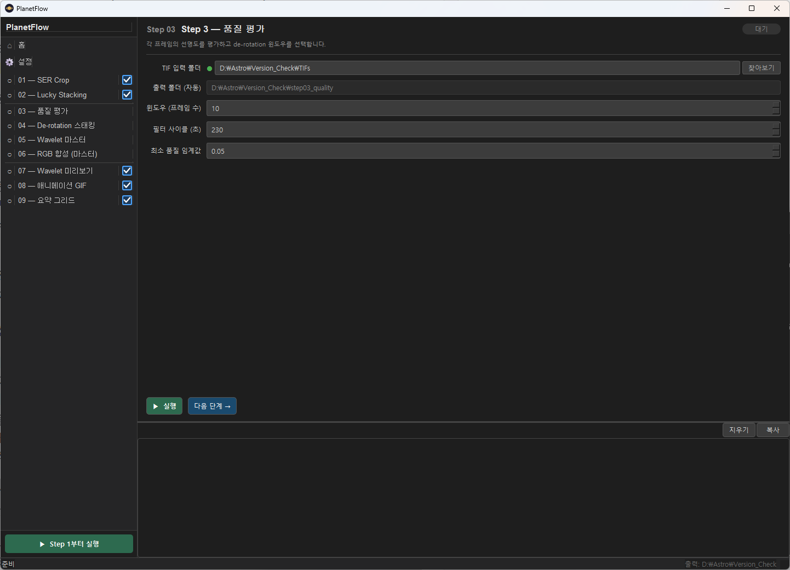

각 TIF 프레임의 화질을 자동으로 평가하고, 가능한 모든 슬라이딩 윈도우를 시계열 순서로 열거합니다.

> **필수 단계**: 이 단계는 건너뛸 수 없습니다.

### 6.1 파라미터

| 파라미터 | 기본값 | 범위 | 설명 |
|----------|--------|------|------|
| **입력 폴더** | 자동 설정 | — | Step 02 Lucky Stacking TIF 폴더가 자동으로 설정됩니다. |
| **출력 폴더** | 자동 설정 | — | 품질 점수 CSV, 윈도우 추천 JSON이 저장됩니다. |
| **윈도우 (프레임 수)** | 3 | 1–20 | de-rotation 윈도우의 길이를 **필터 사이클 수**로 지정합니다. 1 프레임 = 필터 한 사이클(IR→R→G→B→CH4 한 바퀴). 실제 윈도우 시간 = 프레임 수 × 필터 사이클 시간. 예: 3프레임 × 225초 = 675초(약 11분). **목성 권장: 2~4프레임 / 화성·토성: 3~6프레임** |
| **필터 사이클 (초)** | 225 | 10–600 (15 단위) | 필터 한 사이클(IR→R→G→B→CH4→IR 한 바퀴)에 걸리는 시간(초)입니다. 실제 촬영 패턴에 맞춰 입력하세요. 예: 45초 × 5필터 = 225초. |
| **최소 품질 임계값** | 0.05 | 0.0–1.0 (0.05 단위) | 이 점수 미만인 프레임을 윈도우 점수 계산에서 제외합니다. 0.0 = 모든 프레임 포함. 0.2~0.3 = 나쁜 프레임 제거. **너무 높으면 유효 프레임이 부족해질 수 있습니다.** |

> **참고**: Step 03은 시계열 순서대로 **모든** 슬라이딩 윈도우를 열거합니다. 최종적으로 몇 개의 윈도우를 사용할지, 겹침을 허용할지는 Step 09 (요약 그리드)에서 설정합니다.

> **컬러 카메라 모드**: "필터 사이클 (초)" 항목이 **"단일 촬영 시간(초)"** 으로 바뀌고 기본값이 45초로 설정됩니다. 이 경우 1 프레임 = 컬러 프레임 1장 촬영 시간을 의미합니다.


### 6.2 출력 파일

- `{필터명}_ranking.csv`: 각 필터별 TIF 파일의 품질 점수 목록
- `windows.json`: 탐지된 최적 시간 윈도우 정보
- `windows_summary.txt`: 윈도우 요약 텍스트 (사람이 읽기 쉬운 형식)

---

## 7. Step 04 — De-rotation 스태킹
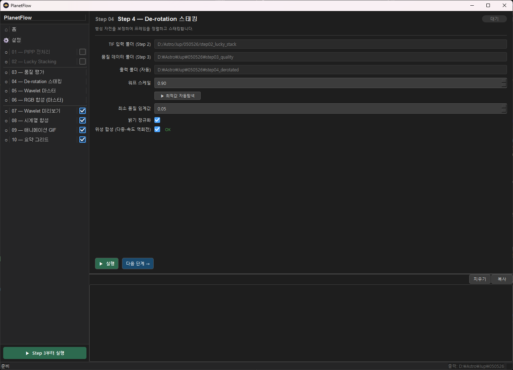

Step 03에서 탐지된 최적 윈도우 내 프레임들을 행성 자전을 보정하며 스태킹합니다.

> **필수 단계**: 이 단계는 건너뛸 수 없습니다.

### 7.1 파라미터

| 파라미터 | 기본값 | 범위 | 설명 |
|----------|--------|------|------|
| **입력 폴더** | 자동 설정 | — | Step 02 Lucky Stacking과 동일한 TIF 폴더가 자동으로 설정됩니다. |
| **출력 폴더** | 자동 설정 | — | De-rotation 스태킹 마스터 TIF가 저장됩니다. |
| **최소 품질 임계값** | 0.05 | 0.0–1.0 (0.05 단위) | 이 점수 미만의 프레임은 스태킹에서 제외됩니다. 시잉이 나쁜 날에는 0.3~0.5로 높여 나쁜 프레임을 더 엄격하게 제거합니다. |
| **밝기 정규화** | Off | — | 스태킹 전 각 프레임의 밝기를 정규화합니다. 시잉 변화로 프레임 간 밝기 차이가 클 경우 활성화합니다. |
| **Satellite Composite** | Off | — | Skyfield BSP 에페메리스를 사용해 위성과 그림자를 합성합니다. 체크박스 옆 상태 표시기로 BSP 파일 가용 여부를 확인하세요 (§7.3 참고). |

### 7.2 Horizons 연동

Step 04는 NASA JPL Horizons API를 사용하여 촬영 시각의 행성 북극 방향각(NP.ang)을 자동으로 조회합니다. 전역 설정의 **Horizons ID**가 올바르게 설정되어야 하며, 인터넷 연결이 필요합니다.

### 7.3 자전 보정 신뢰도 (NCC)

**Warp scale**은 최적 시상 데이터에서 경험적으로 보정된 고정값(기본 1.0)입니다. 윈도우마다 자동으로 결정하지 않습니다 — 행성의 자전 속도는 일정하므로 워프 기하 구조는 시상에 따라 변하지 않습니다.

Step 04가 완료되면(단독 실행 또는 일괄실행 모두), 세션에서 가장 긴 윈도우의 최초·최후 프레임 사이에 **고역통과 NCC 스윕**을 수행합니다. 가우시안 고역통과 필터(σ=30 px)로 림브 암화 편향을 제거한 뒤, warp_scale=1.0에서의 NCC 값을 계산합니다. 이 값이 자전 보정 예측이 실제 벨트 구조와 얼마나 잘 일치하는지를 나타내는 **자전 보정 신뢰도** 지표입니다.

NCC < 0.80이면 경고 다이얼로그가 표시됩니다:

> *자전 보정 NCC 신뢰도가 낮습니다: NCC = X.XXX < 0.8. Step 3의 Window(프레임 수) 설정을 줄이고 Step 3부터 다시 실행하는 것을 권장합니다.*

이 경고는 참고 정보입니다 — 파이프라인은 이미 완료되었고 결과가 저장된 상태입니다. 낮은 신뢰도가 우려된다면 윈도우를 줄여 Step 3부터 재실행하는 것을 권장합니다. 짧은 윈도우는 누적 회전량이 적어 나쁜 시상에서도 더 안정적인 결과를 냅니다.

NCC 값과 측정 상세 정보는 `derotation_summary.txt`의 `derot_confidence` 항목에 기록됩니다.

### 7.4 위성/그림자 합성

**Satellite Composite**를 체크하면 유로파와 그림자를 행성 de-rotation과 독립적으로 처리하여 각 필터 스택에 블렌딩합니다.

**BSP 상태 표시기** (체크박스 옆 색상 라벨):

| 색상 | 의미 | 조치 |
|------|------|------|
| 초록색 — OK | BSP 에페메리스 파일 있음 | 바로 사용 가능 |
| 주황색 — `<파일명> — 첫 실행 시 자동 다운로드` | 파일 없음, 인터넷 연결됨 | 단계 실행 시 자동 다운로드 (de440s.bsp 32 MB + jup365.bsp 1.1 GB) |
| 빨간색 — 네트워크 오류 | 인터넷 연결 없음 | 인터넷 연결 후 패널 재오픈 |
| 빨간색 — `pip install skyfield 필요` | `skyfield` 패키지 미설치 | PlanetFlow 환경에서 `pip install skyfield` 실행 |

**필터 간 위성 위치 일관성**: 유로파와 그림자는 모든 필터(IR, R, G, B, CH4) 출력 TIF에서 **행성 디스크 기준 동일한 위치**에 배치됩니다. 이로 인해 Step 06 채널 정렬 후 IR-RGB, CH4-G-IR 등 모든 합성에서 위성이 동일한 위치에 나타납니다.

---

## 8. Step 05 — Wavelet 마스터 선명화
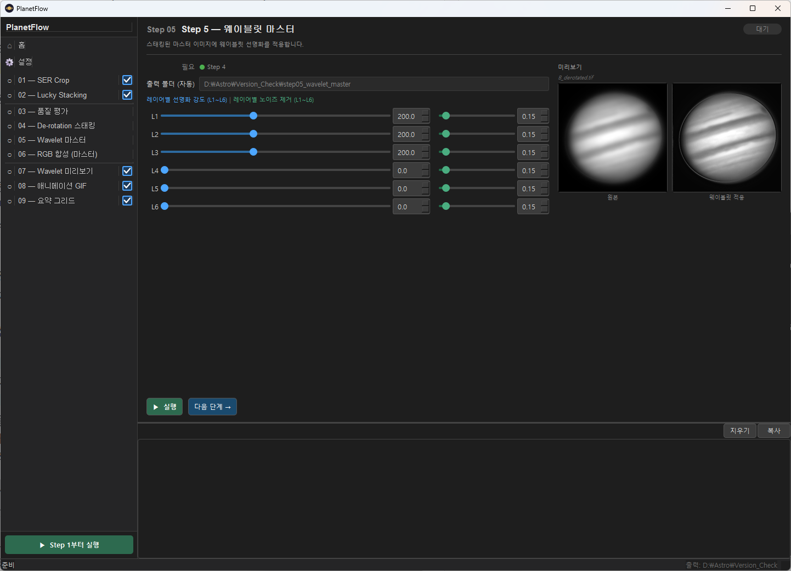

Step 04에서 생성된 마스터 TIF 이미지에 웨이블릿 선명화를 적용합니다. 마스터 이미지는 수천 장의 프레임을 스태킹한 결과이므로 노이즈가 매우 낮아 Step 07보다 더 강한 선명화를 적용할 수 있습니다.

> **필수 단계**: 이 단계는 건너뛸 수 없습니다.

### 8.1 웨이블릿 레벨 (L1 ~ L6)

Step 07과 동일한 구조입니다. 단, 마스터 이미지에 적용되므로 **더 강한 값을 사용해도 안전**합니다.

| 레벨 | 기본값 | 권장 범위 | 특성 |
|------|--------|-----------|------|
| **L1** | 200 | 100–400 | 픽셀 수준의 최고 해상도 디테일 |
| **L2** | 200 | 100–400 | 세밀한 구조 (벨트, 줄무늬) |
| **L3** | 200 | 50–300 | 중간 규모 구조 |
| **L4** | 0 | 0–100 | 대규모 명암 대비 |
| **L5** | 0 | 0–500 | 사용 비권장 |
| **L6** | 0 | 0–500 | 사용 비권장 |

### 8.2 실시간 미리보기

우측 패널에 웨이블릿 선명화 결과 미리보기가 표시됩니다. 슬라이더를 조작하면 자동으로 갱신됩니다.

> **팁**: 마스터 이미지는 SNR이 매우 높으므로 L1, L2를 300~400까지 올려도 아티팩트가 거의 나타나지 않습니다. Step 07과 Step 05의 값을 독립적으로 조정해보세요.

---

## 9. Step 06 — RGB 합성 (마스터)

Step 05의 필터별 마스터 PNG를 합성하여 컬러 이미지를 생성합니다.

> **필수 단계**: 이 단계는 건너뛸 수 없습니다.

카메라 모드에 따라 UI가 완전히 다릅니다.

---
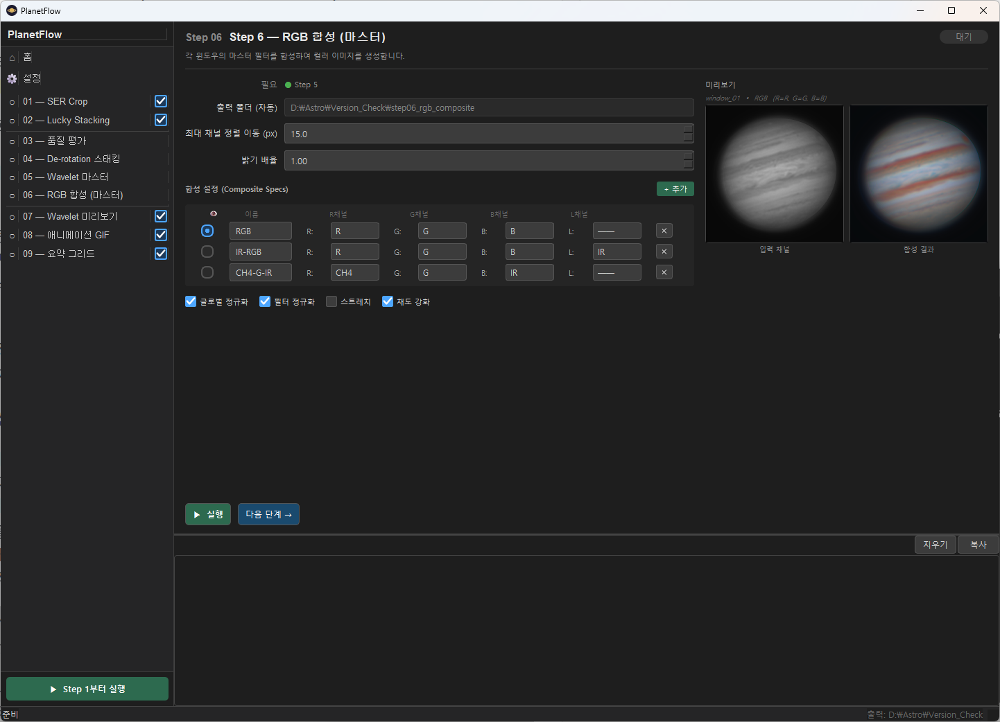


### 9.A 모노 카메라 모드

하나의 세션에서 여러 종류의 합성(RGB, LRGB, 위색 등)을 동시에 만들 수 있습니다.

#### 9.A.1 기본 파라미터

| 파라미터 | 기본값 | 범위 | 설명 |
|----------|--------|------|------|
| **최대 채널 이동량 (px)** | 15.0 | 0.0–100.0 | 채널 간 위상 정렬(phase correlation)에서 허용하는 최대 이동 거리입니다. 이 값보다 큰 이동이 계산되면 정렬을 적용하지 않습니다. 대기 분산이 심한 날에는 20~30으로 높여보세요. |
| **글로벌 정규화 (Global Normalize)** | On | — | 활성화 시 각 윈도우 합성 이미지의 평균 밝기를 전체 윈도우 평균에 맞춰 스케일링합니다. GIF 출력의 윈도우 간 밝기 플리커를 제거합니다. |
| **필터 정규화 (Filter Normalize)** | Off | — | 활성화 시 합성 전 모든 윈도우에 걸쳐 필터별 밝기를 균등화합니다. 각 (필터, 윈도우) 쌍의 행성 디스크 중앙값(median)을 계산하고, 모든 윈도우가 해당 필터의 동일한 디스크 중앙값을 갖도록 스케일링합니다. 다이나믹 레인지를 훼손하지 않으면서 대기 투명도 차이를 보정합니다. |
| **밝기 배율 (Brightness Scale)** | 1.0 | 0.1–2.0 (0.05 단위) | 합성 출력에 곱하는 밝기 배율입니다. 1.0 = 변경 없음. 1.0 미만은 어둡게, 1.0 초과는 밝게 조정합니다. |

#### 9.A.2 합성 설정 테이블

각 행(Row)이 하나의 합성 이미지를 정의합니다.

| 열 | 설명 |
|----|------|
| **👁 (라디오 버튼)** | 어느 합성을 미리보기에 표시할지 선택합니다. 한 번에 하나만 선택됩니다. |
| **이름** | 합성 이미지의 이름입니다. 출력 파일명에 사용됩니다 (예: `RGB_composite.png`). |
| **R 채널** | 빨간 채널에 할당할 필터를 선택합니다. |
| **G 채널** | 초록 채널에 할당할 필터를 선택합니다. |
| **B 채널** | 파란 채널에 할당할 필터를 선택합니다. |
| **L 채널** | 루마(밝기) 채널에 할당할 필터입니다. 선택하면 **LRGB 합성** 모드가 됩니다. `──` = 미사용 (일반 RGB). |
| **✕** | 이 합성 설정을 삭제합니다. |

#### 기본 합성 설정

| 이름 | R | G | B | L | 설명 |
|------|---|---|---|---|------|
| **RGB** | R | G | B | (없음) | 기본 3색 합성 |
| **IR-RGB** | R | G | B | IR | IR을 루마로 사용하는 LRGB. 적외선 채널의 높은 해상도가 밝기 디테일을 살립니다. |
| **CH4-G-IR** | CH4 | G | IR | (없음) | 메탄 밴드 위색 합성. 목성의 구름 구조 및 대적점 특성을 강조합니다. |

**+ 추가** 버튼으로 새로운 합성 설정을 추가할 수 있습니다.

#### 9.A.3 실시간 미리보기

우측에 현재 선택된(라디오 버튼) 합성의 미리보기가 표시됩니다. R/G/B/L 채널 드롭다운을 변경하면 400ms 후 자동 갱신됩니다.

> **참고**: 미리보기는 채널 정렬(phase correlation) 없이 빠르게 계산됩니다. 채널 정렬 효과는 실행 후 결과 파일에서 확인하세요.

---

### 9.B 컬러 카메라 모드
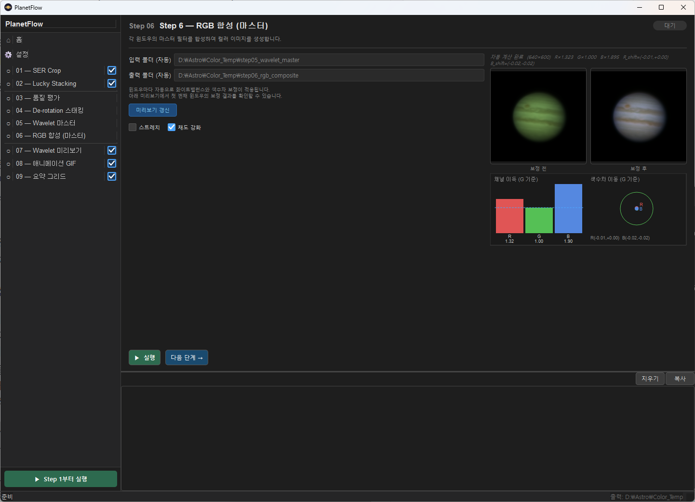

컬러 카메라 모드에서는 수동 채널 설정 대신, **자동 화이트밸런스(WB) + 색수차(CA) 보정**이 파이프라인에서 자동으로 수행됩니다.

- **설정 항목 없음**: 모든 보정이 알고리즘으로 자동 결정됩니다. 윈도우마다 독립적으로 계산됩니다.
- **"미리보기 갱신" 버튼**: Step 5 PNG를 불러와 자동 보정 결과를 미리볼 수 있습니다.
- **보정 전/후 패널**: 원본(보정 전)과 보정 결과를 나란히 비교합니다.
- **채널 이득 그래프**: R/G/B 이득(WB) 및 R/B 채널의 색수차 이동량(CA)을 시각적으로 표시합니다.

---

## 10. Step 07 — Wavelet 미리보기


Step 02 Lucky Stacking이 출력한 TIF 파일에 웨이블릿 선명화를 적용하여 PNG로 변환합니다. 미리보기 및 시각적 확인 용도로 사용됩니다.

> **선택적 단계**: 웨이블릿 적용 결과를 시각적으로 확인하고 싶을 때 실행합니다.

### 10.1 파라미터

| 파라미터 | 기본값 | 범위 | 설명 |
|----------|--------|------|------|
| **입력 폴더** | 자동 설정 | — | 처리할 TIF 파일 폴더입니다. Step 02가 활성화된 경우 자동으로 연결되며, 그 외에는 직접 입력하거나 탐색 버튼으로 선택합니다. |
| **출력 폴더** | 자동 설정 | — | 입력 폴더 옆의 `step07_wavelet_preview`로 자동 설정됩니다. |
| **컬러 보정 적용** | On | — | *(컬러 카메라 모드 전용)* 출력 PNG에 자동 화이트밸런스 및 색수차(CA) 보정을 적용합니다. 원본 색상 그대로 출력하려면 비활성화하세요. |

### 10.2 웨이블릿 레벨 (L1 ~ L6)

| 레벨 | 기본값 | 범위 | 특성 |
|------|--------|------|------|
| **L1** | 200 | 0–500 | 가장 미세한 디테일 (픽셀 수준 선명화) |
| **L2** | 200 | 0–500 | 세밀한 디테일 |
| **L3** | 200 | 0–500 | 중간 디테일 |
| **L4** | 0 | 0–500 | 큰 구조 (노이즈 증폭 위험) |
| **L5** | 0 | 0–500 | 더 큰 구조 |
| **L6** | 0 | 0–500 | 가장 큰 구조 |

- 슬라이더와 숫자 입력창이 **양방향으로 연동**됩니다.
- 행성 촬영에는 **L1~L3만 활성화**하는 것을 권장합니다. L4 이상은 노이즈를 과도하게 증폭할 수 있습니다.
- 이 값들은 Step 07의 미리보기용 선명화에만 적용됩니다. 마스터 이미지의 최종 선명화는 Step 05에서 별도로 설정합니다.

---

## 11. Step 08 — 애니메이션 GIF
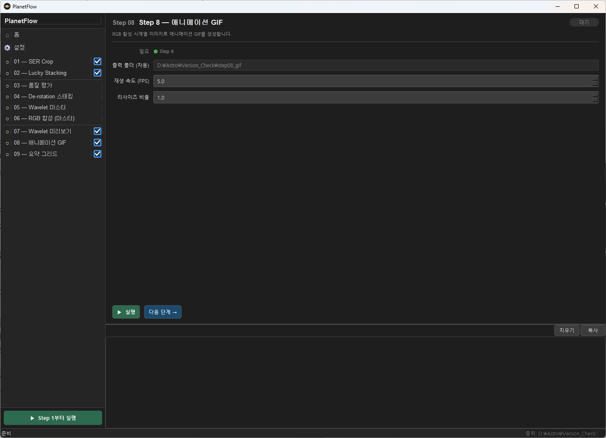

Step 06의 RGB 합성 이미지를 이어붙여 행성 자전 애니메이션 GIF를 생성합니다.

> **선택적 단계**: 자전 애니메이션이 필요한 경우에만 실행합니다.

### 11.1 파라미터

| 파라미터 | 기본값 | 범위 | 설명 |
|----------|--------|------|------|
| **입력 폴더** | 자동 설정 | — | `step06_rgb_composite/` 폴더가 자동으로 설정됩니다. |
| **출력 폴더** | 자동 설정 | — | 애니메이션 GIF 파일이 저장됩니다. |
| **FPS** | 6.0 | 1.0–30.0 (0.5 단위) | GIF 재생 속도(초당 프레임 수)입니다. 6~10 FPS가 행성 자전 애니메이션에 일반적입니다. |
| **크기 배율** | 1.0 | 0.1–2.0 (0.1 단위) | 출력 GIF의 크기 배율입니다. 1.0 = 원본 크기, 0.5 = 절반 크기(파일 용량 절감). |

---

## 12. Step 09 — 요약 그리드
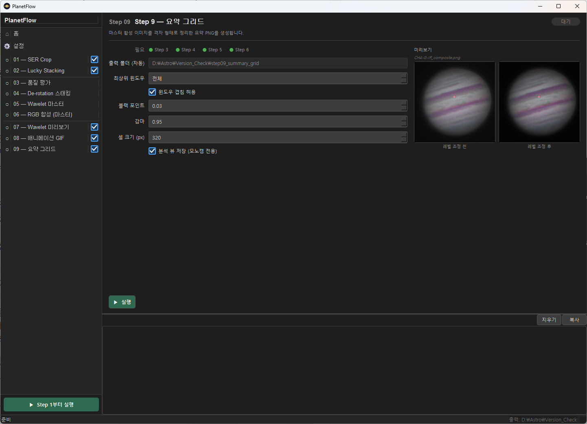

Step 06의 RGB 합성 결과를 레벨 보정하여 요약 그리드 이미지를 생성합니다. 관측 보고서나 포럼 게시용 최종 이미지 생성에 사용합니다.

두 가지 출력 파일이 생성됩니다.

| 파일 | 내용 | 생성 조건 |
|------|------|-----------|
| `summary_grid_simple.png` | 합성 이미지만 (전체 카메라 모드) | 항상 |
| `summary_grid.png` | 합성(왼쪽) + Step 05 필터 이미지(오른쪽), 동일 셀 크기 | 모노 모드이고 Step 05 출력 있을 때 |

> **선택적 단계**: 필요한 경우에만 사용합니다.

### 12.1 파라미터

| 파라미터 | 기본값 | 범위 | 설명 |
|----------|--------|------|------|
| **입력 폴더 (Step 06)** | 자동 설정 | — | Step 06 RGB 합성 결과 폴더로 자동 설정됩니다. |
| **입력 폴더 (Step 05)** | 자동 설정 | — | Step 05 웨이블릿 마스터 폴더입니다. 2존 그리드(`summary_grid.png`)의 필터 이미지 영역에 사용됩니다. 모노 모드에서만 표시됩니다. |
| **출력 폴더** | 자동 설정 | — | 요약 그리드 PNG가 저장됩니다. |
| **상위 N개 윈도우 (N Best Windows)** | 0 | 0–20 | 그리드에 포함할 상위 품질 윈도우 수입니다. **0 = 전체**: Step 03에서 열거된 모든 윈도우를 포함합니다. **N > 0**: 품질 점수 기준 상위 N개 윈도우만 선택합니다. |
| **윈도우 겹침 허용 (Allow Window Overlap)** | Off | — | N Best Windows > 0일 때, 선택된 윈도우의 시간 범위 겹침을 허용할지 결정합니다. **Off** (기본값): 그리디 비겹침 선택 — 각 윈도우가 시간적으로 중복되지 않도록 선택합니다. **On**: 점수 순 상위 N개를 겹침에 상관없이 선택합니다. |
| **블랙 포인트** | 0.04 | 0.0–0.5 (0.01 단위) | 이 값 이하의 픽셀을 순수 검정(0)으로 처리합니다. 배경 하늘 노이즈를 억제하고 행성의 테두리를 깔끔하게 만듭니다. 0.02~0.08 범위를 권장합니다. |
| **감마 (Gamma)** | 0.9 | 0.1–3.0 (0.05 단위) | 밝기 감마 보정값입니다. **1.0** = 보정 없음 / **< 1.0** = 밝아짐 (대부분 0.8~1.0 권장) / **> 1.0** = 어두워짐. |
| **셀 크기 (px)** | 300 | 100–1024 (50 단위) | 그리드에서 각 합성 이미지를 표시할 크기(px)입니다. |
| **Analytic View 저장** | Off | — | 체크 시 윈도우마다 `window_XX_analytic.png`를 `analytic/` 하위 폴더에 저장합니다. 모노 모드에서만 사용 가능합니다. |

### 12.2 실시간 미리보기

우측에 레벨 조정 전후 미리보기가 표시됩니다. 파라미터를 변경하면 400ms 후 자동 갱신됩니다.

### 12.3 Analytic View 지표 해설


Analytic View(`window_XX_analytic.png`)는 윈도우당 한 장씩 생성되며, 이미지 아래에 두 구역의 지표 블록이 표시됩니다.

#### 필터별 지표 (이미지 바로 아래, 경계선 위)

각 단색 필터 열에 해당하는 숫자가 이미지 정렬로 표시됩니다.

| 지표 | 의미 | 해석 기준 |
|------|------|-----------|
| **Frames** | `사용된 프레임 / 전체 프레임` | 비율이 낮으면 기상이나 행성 흔들림으로 많은 프레임이 탈락된 것. 50% 미만이면 관측 조건이 불량했음을 의미. |
| **Q.Post** | 이상치 제거 후 선택 프레임들의 평균 품질 점수 (0~1) | 높을수록 샤프한 프레임이 많이 남은 것. 행성 크기·시상 조건에 따라 절대 수치보다 필터 간 상대 비교가 유용. |
| **Stab.** | 대기 안정도 (0~1) | 짧은 시간 내 품질 변동이 적을수록 높음. 낮으면 시상이 불안정하여 일부 프레임만 선택된 것. |
| **Stacked** | Lucky stacking 후 실제 합산된 프레임 수 | Frames의 `사용된 프레임`에서 추가 품질 필터링 후 최종 스택에 포함된 수. |

#### 합성 Align 테이블 (합성 이미지 아래, 경계선 위)

각 합성(RGB, IR-RGB 등)에서 각 필터 이미지가 기준 채널에 맞춰 얼마나 이동됐는지 보여줍니다.

- **행** = 필터명 (IR, R, G, B, CH4 …) — 합성 중 하나 이상에서 사용된 모든 필터
- **셀 값** = `[역할] 이동량` — `[역할]`은 해당 합성에서 이 필터가 담당하는 채널(`[L]`, `[R]`, `[G]`, `[B]`), `이동량`은 `(Δx, Δy)` (픽셀 단위)
- **`[역할] ref`** — 해당 합성의 정렬 기준 채널로 사용됨 (이동 없음)
- **`—`** — 해당 합성에 이 필터가 사용되지 않음
- **`[Sat]`** 행 — 각 합성에 적용된 채도 강화 배율 (1.00 = 원본 채도 유지)

#### 하단 글로벌 파라미터 줄

| 지표 | 의미 | 해석 기준 |
|------|------|-----------|
| **Win.Q** | 윈도우 전체 품질 점수 (0~1) | 해당 시간 구간의 전반적인 시상 품질. 복수 윈도우가 있을 경우 창간 비교에 유용. |
| **Rot** | 윈도우 내 행성 자전으로 인한 누적 회전량 (도) | 클수록 De-rotation 보정이 중요해짐. 목성은 빠르게 자전하므로 긴 윈도우에서 커질 수 있음. |
| **Wvl** | Wavelet 선명화 레이어 강도 `[L1 L2 L3 L4 L5 L6]` | 큰 값일수록 해당 공간 주파수 대역을 강하게 강조. 0이면 해당 레이어 비활성. |
| **bp** | 블랙 포인트 (Black Point) | 이 값 이하의 픽셀을 순수 검정으로 클리핑. 배경 하늘 노이즈 억제에 사용. |
| **γ** | 감마 보정값 | < 1.0이면 밝아짐, > 1.0이면 어두워짐. 1.0은 보정 없음. |

---

## 13. 전체 실행 (Run All)
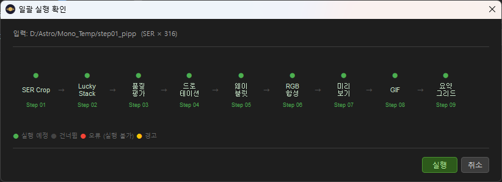

좌측 사이드바 하단의 일괄 실행 버튼을 클릭하면 활성화된 단계를 순서대로 자동 실행합니다.

### 13.1 시작 지점

버튼 레이블이 Step 01/02 활성화 여부에 따라 동적으로 변경됩니다.

| 조건 | 버튼 레이블 | 시작점 | 검증 대상 |
|------|-------------|--------|-----------|
| Step 01 ✓ | **▶ Step 1부터 실행** | Step 01 | SER 파일 (SER 입력 폴더) |
| Step 01 ✗, Step 02 ✓ | **▶ Step 2부터 실행** | Step 02 | SER 파일 (Step 02 SER 폴더) |
| Step 01 ✗, Step 02 ✗ | **▶ Step 3부터 실행** | Step 03 | TIF 파일 (입력 폴더) |

> **참고**: Step 01을 활성화하면 Step 02 체크박스가 자동으로 ON 되고 잠금 처리됩니다.

### 13.2 실행 흐름

1. **입력 검증**: 시작 지점에 해당하는 폴더에 입력 파일이 있는지 확인합니다. 없으면 경고 후 중단합니다.
2. **확인 다이얼로그**: 실행할 단계 목록, 입력 파일 수, 각 단계의 출력 경로가 표시됩니다. "실행"을 눌러야 시작합니다.
3. **단계별 실행**: 활성화된 단계만 실행하고, 비활성화된 선택적 단계는 건너뜁니다.
4. **오류 처리**: 실행 중 오류가 발생하면 해당 단계에서 중단되고 오류 메시지가 로그에 출력됩니다.

> **De-rotation 단계 자동 스킵**: TIF 파일 수가 de-rotation 윈도우 하나를 구성하기에 부족한 경우, Step 03~06 및 Step 08~09가 자동으로 건너뛰어지고 Step 07 (웨이블릿 미리보기)만 실행됩니다. 확인 다이얼로그에 발견된 파일 수 및 필요한 파일 수가 경고로 표시됩니다.

---

## 14. 출력 폴더 구조

파이프라인 실행 후 출력 기준 폴더(예: `260402_output/`) 아래에 다음 폴더가 생성됩니다.

```
{output_base}/
├── step03_quality/             # Step 03: 품질 평가 결과
│   ├── {필터명}_ranking.csv
│   ├── windows.json
│   └── windows_summary.txt
├── step04_derotated/           # Step 04: De-rotation 마스터 TIF
│   └── window_01/
│       ├── IR_master.tif
│       ├── R_master.tif
│       └── ...
├── step05_wavelet_master/      # Step 05: 웨이블릿 마스터 PNG
│   └── window_01/
│       ├── IR_master.png
│       ├── R_master.png
│       └── ...
├── step06_rgb_composite/       # Step 06: RGB 합성 PNG
│   └── window_01/
│       ├── RGB_composite.png
│       ├── IR-RGB_composite.png
│       ├── CH4-G-IR_composite.png
│       └── ...
├── step07_wavelet_preview/     # Step 07: 웨이블릿 처리된 미리보기 PNG
│   ├── 2026-03-20-1046_1-U-IR-Jup_..._wavelet.png
│   └── ...
├── step08_gif/                 # Step 08: 애니메이션 GIF
│   └── RGB_animation.gif
└── step09_summary_grid/        # Step 09: 요약 그리드 PNG
    ├── summary_grid_simple.png   # 합성 이미지만 (항상 생성)
    ├── summary_grid.png          # 합성 + 단색 필터 (모노 카메라, Step 05 데이터 있을 때)
    └── analytic/
        ├── window_01_analytic.png
        └── window_02_analytic.png
```
