# 행성 촬영 후처리 자동화 파이프라인 — 사용자 가이드

> **버전**: 현재 개발 버전  
> **대상 사용자**: 고급 행성 촬영자 (Firecapture, AutoStakkert!4, WinJUPOS 경험자)

---

## 목차

1. [개요](#1-개요)
2. [메인 화면 구성](#2-메인-화면-구성)
3. [전역 설정 (Settings)](#3-전역-설정-settings)
4. [Step 01 — PIPP 전처리](#4-step-01--pipp-전처리)
5. [Step 02 — AutoStakkert!4](#5-step-02--autostakkert4)
6. [Step 03 — Wavelet 미리보기](#6-step-03--wavelet-미리보기)
7. [Step 04 — 품질 평가 및 윈도우 탐지](#7-step-04--품질-평가-및-윈도우-탐지)
8. [Step 05 — De-rotation 스태킹](#8-step-05--de-rotation-스태킹)
9. [Step 06 — Wavelet 마스터 선명화](#9-step-06--wavelet-마스터-선명화)
10. [Step 07 — RGB 합성 (마스터)](#10-step-07--rgb-합성-마스터)
11. [Step 08 — 시계열 RGB 합성](#11-step-08--시계열-rgb-합성)
12. [Step 09 — 애니메이션 GIF](#12-step-09--애니메이션-gif)
13. [Step 10 — 요약 그리드](#13-step-10--요약-그리드)
14. [전체 실행 (Run All)](#14-전체-실행-run-all)
15. [출력 폴더 구조](#15-출력-폴더-구조)
16. [파라미터 빠른 참조](#16-파라미터-빠른-참조)

---

## 1. 개요

이 도구는 행성 고해상도 촬영 후처리 과정을 자동화하는 GUI 파이프라인입니다. PIPP로 전처리한 SER 영상부터 시작하여, AutoStakkert!4 스태킹 결과를 받아 웨이블릿 선명화 → 품질 평가 → de-rotation 스태킹 → RGB 합성 → 시계열 애니메이션 → 요약 그리드 생성까지 전 과정을 단계별로 안내합니다.

### 전체 워크플로우

```
촬영 SER 파일
     │
     ▼
[Step 01] PIPP 전처리        ← SER → 크롭된 SER (선택)
     │
     ▼
[Step 02] AutoStakkert!4     ← 수동 실행 (GUI 외부)
     │
     ▼
[Step 03] Wavelet 미리보기   ← TIF → 선명화 PNG (필수)
     │
     ▼
[Step 04] 품질 평가          ← 최적 시간 윈도우 탐지 (필수)
     │
     ▼
[Step 05] De-rotation 스태킹 ← 자전 보정 + 스태킹 (필수)
     │
     ▼
[Step 06] Wavelet 마스터     ← 마스터 이미지 선명화 (필수)
     │
     ▼
[Step 07] RGB 합성 (마스터)  ← 필터 채널 합성 (필수)
     │
     ├──────────────────────────────────────────────┐
     ▼                                              ▼
[Step 08] 시계열 RGB 합성   ← 시간대별 합성 (선택)
     │
     ▼
[Step 09] 애니메이션 GIF    ← 자전 시계열 애니메이션 (선택)

[Step 10] 요약 그리드       ← Step 07 결과 → 레벨 보정 + 그리드 (선택)
```

---

## 2. 메인 화면 구성

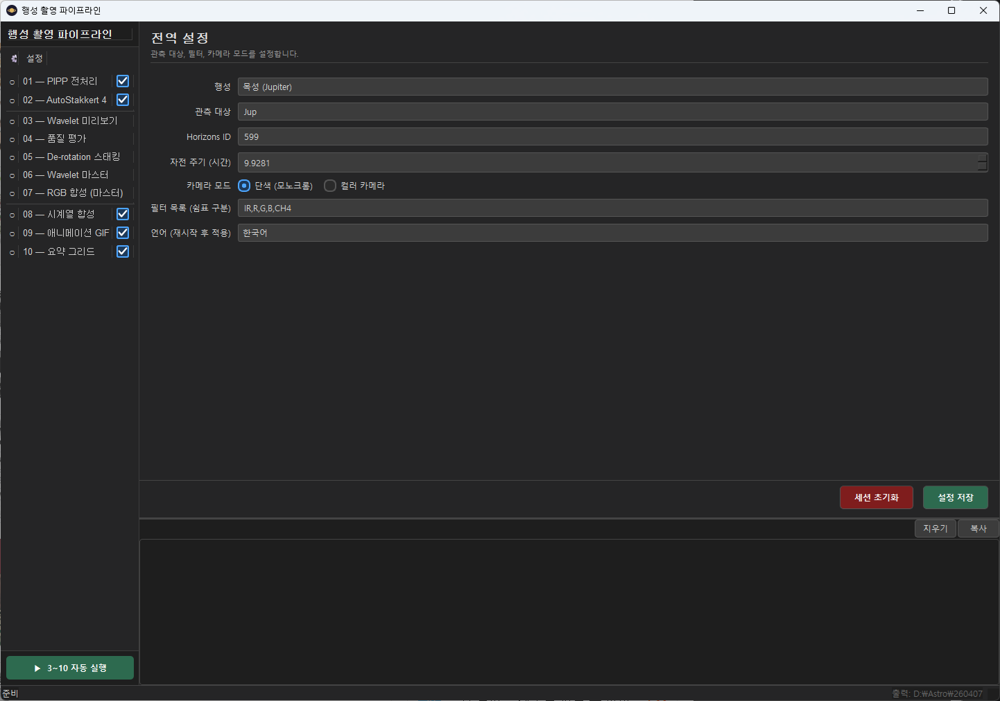
*그림 2-1: 메인 화면 전체 레이아웃*

### 2.1 좌측 사이드바

화면 좌측에는 단계 목록이 있습니다.

| 구성 요소 | 설명 |
|-----------|------|
| **⚙ Settings** | 전역 설정 패널로 이동합니다. 행성 프리셋, 카메라 모드, 필터 구성을 설정합니다. |
| **단계 목록** | Step 01 ~ Step 10을 클릭하여 해당 패널로 이동합니다. |
| **선택적 (Optional)** | 회색 또는 별도 표시된 단계는 건너뛸 수 있습니다. |
| **구분선** | Step 03 앞과 Step 08 앞에 구분선이 있습니다. Step 01은 선택적, Step 02는 외부 도구 연동, Step 03~07은 핵심 처리, Step 08~10은 추가 결과물입니다. |

### 2.2 우측 메인 영역

| 구성 요소 | 설명 |
|-----------|------|
| **패널 영역** | 선택한 단계의 설정 화면이 표시됩니다. |
| **로그 영역** | 하단에 파이프라인 실행 로그가 출력됩니다. |

### 2.3 상태 표시줄

화면 하단 상태 표시줄에는 현재 출력 폴더 경로와 파이프라인 준비 상태가 표시됩니다.

### 2.4 공통 버튼

각 단계 패널 하단에는 다음 버튼들이 있습니다.

| 버튼 | 설명 |
|------|------|
| **실행** | 현재 단계만 실행합니다. |
| **다음 단계 →** | 실행 후 자동으로 다음 단계 패널로 이동합니다. Step 10에는 없습니다. |

---

## 3. 전역 설정 (Settings)


*그림 3-1: 전역 설정 패널*

전역 설정은 파이프라인 전체에 영향을 미치는 기본 값을 정의합니다. 작업 시작 전 반드시 확인하세요.

### 3.1 행성 프리셋

| 프리셋 | 목표명 | Horizons ID | 자전 주기 |
|--------|--------|-------------|-----------|
| **Jupiter** | Jup | 599 | 9.9281 h |
| **Saturn** | Sat | 699 | 10.56 h |
| **Mars** | Mar | 499 | 24.6229 h |
| ... | ... | ... | ... |

프리셋을 선택하면 아래 필드가 자동으로 채워집니다.

### 3.2 파라미터 상세

| 파라미터 | 기본값 | 설명 |
|----------|--------|------|
| **행성 프리셋** | Jupiter | 목표 행성을 선택합니다. Custom 선택 시 아래 세 필드를 직접 입력합니다. |
| **목표명 (Target)** | Jup | 파이프라인 내부에서 파일명과 로그에 사용되는 짧은 식별자입니다. |
| **Horizons ID** | 599 | NASA JPL Horizons 서비스의 천체 ID입니다. |
| **자전 주기 (h)** | 9.9281 | 행성의 자전 주기(시간)입니다. Step 05에서 자전 보정 계산의 기준이 됩니다. |
| **카메라 모드** | Mono | **Mono**: 필터 휠 사용, 필터별 SER 파일. **Color**: 단일 컬러 카메라, Bayer RGB. 컬러 선택 시 필터 목록이 `COLOR`로 자동 설정됩니다. |
| **필터 목록** | IR,R,G,B,CH4 | 사용하는 필터를 쉼표로 구분하여 입력합니다. 이 목록이 Step 07 합성 설정의 드롭다운 항목이 됩니다. 컬러 카메라 선택 시 자동으로 `COLOR`로 설정되고 편집이 비활성화됩니다. |
| **언어** | ko | 인터페이스 언어를 선택합니다. 변경 후 재시작해야 적용됩니다. |

> **팁**: 촬영 세션별로 설정이 세션 파일에 저장됩니다. 다음에 도구를 열면 이전 설정이 자동 복원됩니다.

---

## 4. Step 01 — PIPP 전처리

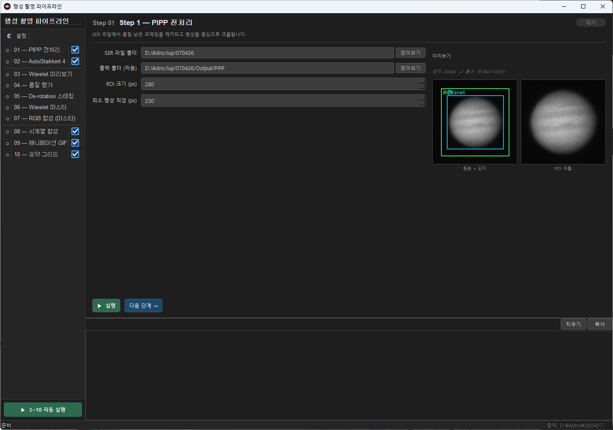
*그림 4-1: Step 01 패널 — 좌측: 폼, 우측: SER 프레임 미리보기*

PIPP(Planetary Imaging PreProcessor)를 사용하여 SER 영상을 행성 중심으로 크롭하고 ROI(Region of Interest)를 추출합니다.

> **선택적 단계**: SER 파일이 이미 크롭되어 있거나, PIPP를 별도로 실행했거나, 별도의 크롭이 필요없다고 판단된다면 이 단계를 건너뛸 수 있습니다.

### 4.1 파라미터

| 파라미터 | 기본값 | 범위 | 설명 |
|----------|--------|------|------|
| **SER 영상 폴더** | (필수 입력) | — | SER 파일이 있는 촬영 폴더 경로입니다. 하위 폴더를 포함하여 모든 `.SER` 파일을 자동으로 찾습니다. 우측 `...` 버튼으로 탐색하거나 직접 경로를 입력하세요. |
| **출력 폴더** | 자동 설정 | — | PIPP 처리된 SER 파일이 저장될 폴더입니다. 전역 설정의 출력 기준 폴더 아래에 자동으로 설정됩니다. |
| **ROI 크기 (px)** | 448 | 64–1024 (16 단위) | PIPP 출력 이미지의 정사각형 크롭 크기입니다. 행성 원반보다 충분히 크게 설정하세요. 목성에는 448~512px이 일반적입니다. 값이 너무 작으면 행성이 잘릴 수 있습니다. |
| **최소 원반 지름 (px)** | 50 | 10–500 (5 단위) | 유효한 행성으로 인정할 최소 원반 크기입니다. 이보다 작은 원반이 감지된 프레임은 불량 프레임으로 처리되어 제거됩니다. 대기 난류로 인해 행성이 매우 흐릿한 프레임을 걸러내는 데 사용합니다. |

### 4.2 실시간 미리보기

오른쪽 패널에 미리보기가 표시됩니다.

- **좌측 패널 (원본 + 감지)**: SER 파일에서 추출한 대표 프레임과 행성 감지 결과를 보여줍니다.
  - **파란 상자 (Planet)**: 자동 감지된 행성 영역
  - **초록 상자 (ROI)**: 설정된 ROI 크기로 크롭될 영역
- **우측 패널 (ROI 크롭)**: 실제 출력될 크롭 결과를 미리 보여줍니다.

ROI 크기나 최소 원반 지름을 변경하면 미리보기가 자동으로 갱신됩니다.

> **참고**: ROI 상자(초록)가 행성(파란)보다 충분히 커야 합니다. ROI 상자가 이미지 경계를 벗어나면 경고가 표시됩니다.

---

## 5. Step 02 — AutoStakkert!4

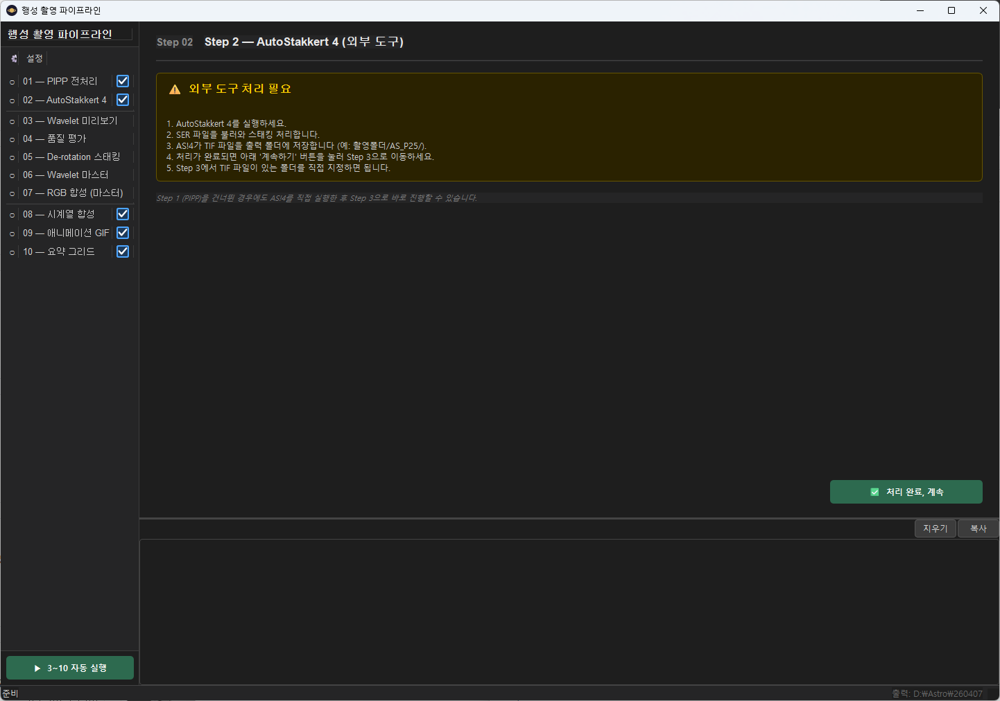
*그림 5-1: Step 02 패널 — AutoStakkert!4 수동 실행 안내*

현재 AutoStakkert!4 수준의 스택 구현이 어렵습니다. 이에 따라 스택은 AutoStakkert!4의 사용을 전제로 제작되었습니다. AutoStakkert!4는 외부 프로그램이므로 파이프라인에서 직접 실행할 수 없습니다. 이 단계는 AS!4를 실행하는 방법을 안내하는 정보 패널입니다.

> **선택적 단계**: AS!4 스태킹이 이미 완료된 경우 건너뛰세요.

### 진행 방법

1. 이 패널의 안내에 따라 **AutoStakkert!4를 별도로 실행**합니다.
2. Step 01의 출력 폴더(PIPP 처리된 SER)를 AS!4 입력으로 사용합니다.
3. AS!4 스태킹이 완료되면 **"완료"** 버튼을 클릭하여 다음 단계로 진행합니다.

AS!4 출력 TIF 파일의 경로는 Step 03에서 직접 지정합니다.

---

## 6. Step 03 — Wavelet 미리보기

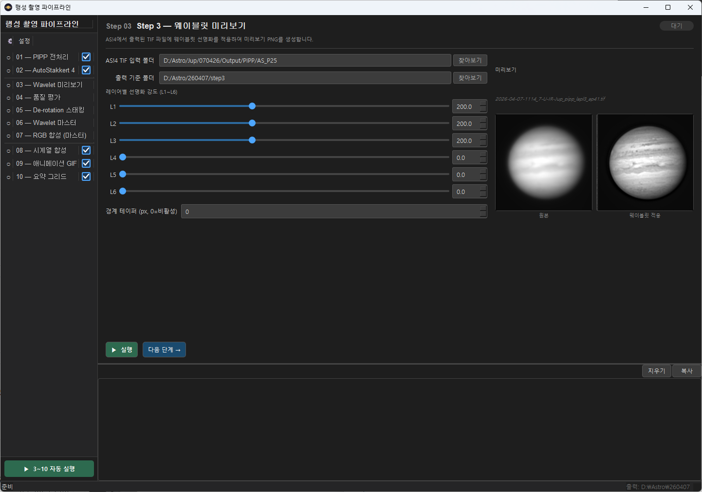
*그림 6-1: Step 03 패널 — 웨이블릿 선명화 설정*

AutoStakkert!4가 출력한 TIF 파일에 웨이블릿 선명화를 적용하여 PNG로 변환합니다. 이 PNG들은 Step 04 품질 평가의 입력으로 사용됩니다.

> **필수 단계**: 이 단계는 건너뛸 수 없습니다.

### 6.1 파라미터

| 파라미터 | 기본값 | 범위 | 설명 |
|----------|--------|------|------|
| **AS!4 TIF 폴더** | (필수 입력) | — | AutoStakkert!4가 TIF 파일을 저장한 폴더입니다. 이 폴더 안의 모든 `.tif` / `.TIF` 파일을 처리합니다. 우측 `...` 버튼으로 선택하거나 직접 입력합니다. |
| **출력 폴더** | 자동 설정 | — | 웨이블릿 처리된 PNG 파일이 저장되는 폴더입니다. TIF 입력 폴더 선택 시 동일 경로 아래에 자동 설정됩니다. |
| **Border Taper (px)** | 0 | 0–100 (5 단위) | 이미지 가장자리에 부드러운 페이드를 적용합니다. 0 = 비활성 (권장). 웨이블릿 처리 후 가장자리에서 링잉(ringing) 아티팩트가 심하게 나타날 때만 사용합니다. |

### 6.2 웨이블릿 레벨 (L1 ~ L6)

| 레벨 | 기본값 | 범위 | 특성 |
|------|--------|------|------|
| **L1** | 200 | 0–500 | 가장 미세한 디테일 (픽셀 수준 선명화) |
| **L2** | 200 | 0–500 | 세밀한 디테일 |
| **L3** | 200 | 0–500 | 중간 디테일 |
| **L4** | 0 | 0–500 | 큰 구조 (노이즈 증폭 위험) |
| **L5** | 0 | 0–500 | 더 큰 구조 |
| **L6** | 0 | 0–500 | 가장 큰 구조 |

- 슬라이더와 숫자 입력창이 **양방향으로 연동**됩니다.
- 이 값들은 Step 03의 미리보기용 선명화에 적용됩니다. 마스터 이미지의 최종 선명화는 Step 06에서 별도로 설정합니다.

---

## 7. Step 04 — 품질 평가 및 윈도우 탐지

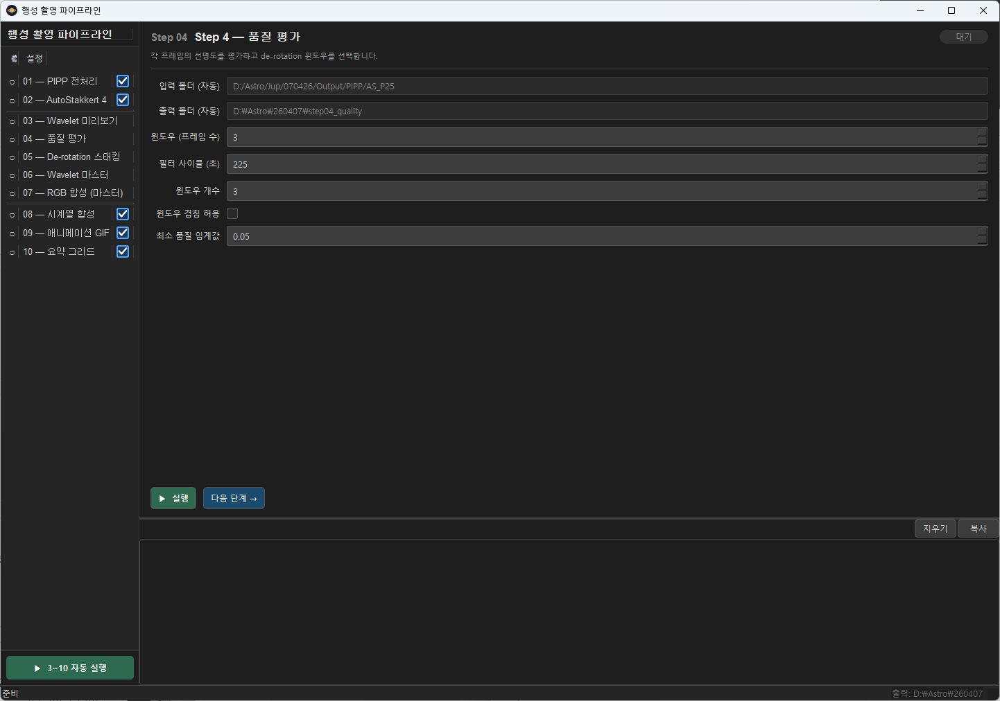
*그림 7-1: Step 04 패널 — 품질 평가 설정*

각 TIF 프레임의 화질을 자동으로 평가하고, 스태킹에 최적인 시간 윈도우를 탐지합니다.

> **필수 단계**: 이 단계는 건너뛸 수 없습니다.

### 7.1 파라미터

| 파라미터 | 기본값 | 범위 | 설명 |
|----------|--------|------|------|
| **입력 폴더** | 자동 설정 | — | Step 03과 동일한 AS!4 TIF 폴더가 자동으로 설정됩니다. |
| **출력 폴더** | 자동 설정 | — | 품질 점수 CSV, 윈도우 추천 JSON이 저장됩니다. |
| **윈도우 길이 (프레임 수)** | 3 | 1-20 | De-rotation stack을 진행할 윈도우의 길이입니다. 필터 사이클을 포함한 전체 촬영 시간을 고려하여 지정하십시오. **목성**: 15분, **화성/토성**: 20~30분 이내를 권장합니다. |
| **필터 사이클 (초)** | 225 | 10–600 | 필터 한 사이클(IR→R→G→B→CH4→IR 한 바퀴)에 걸리는 시간(초)입니다. |
| **윈도우 개수** | 1 | 1–10 | 탐지할 최적 윈도우의 수입니다. **1**: 가장 좋은 단일 윈도우만 찾습니다 (Step 05 스태킹용). **2~3**: 시간대별 여러 윈도우를 탐지합니다 (Step 08 시계열 합성용). |
| **윈도우 중복 허용** | Off | — | 체크 시: 탐지된 윈도우가 서로 시간 범위를 겹칠 수 있습니다. 체크 해제: 각 윈도우는 겹치지 않습니다 (기본값). 데이터가 짧을 때 여러 윈도우를 탐지하려면 체크합니다. |
| **최소 품질 임계값** | 0.05 | 0.0–1.0 | 이 점수 미만인 프레임을 최적 윈도우 계산에서 제외합니다. 0.0 = 모든 프레임 포함. 0.2~0.3 = 나쁜 프레임 제거. **너무 높으면 유효 프레임이 부족해질 수 있습니다.** |

### 7.2 출력 파일

- `quality_scores.csv`: 각 TIF 파일의 품질 점수 목록
- `windows.json`: 탐지된 최적 시간 윈도우 정보
- `windows_summary.txt`: 윈도우 요약 텍스트 (사람이 읽기 쉬운 형식)

---

## 8. Step 05 — De-rotation 스태킹

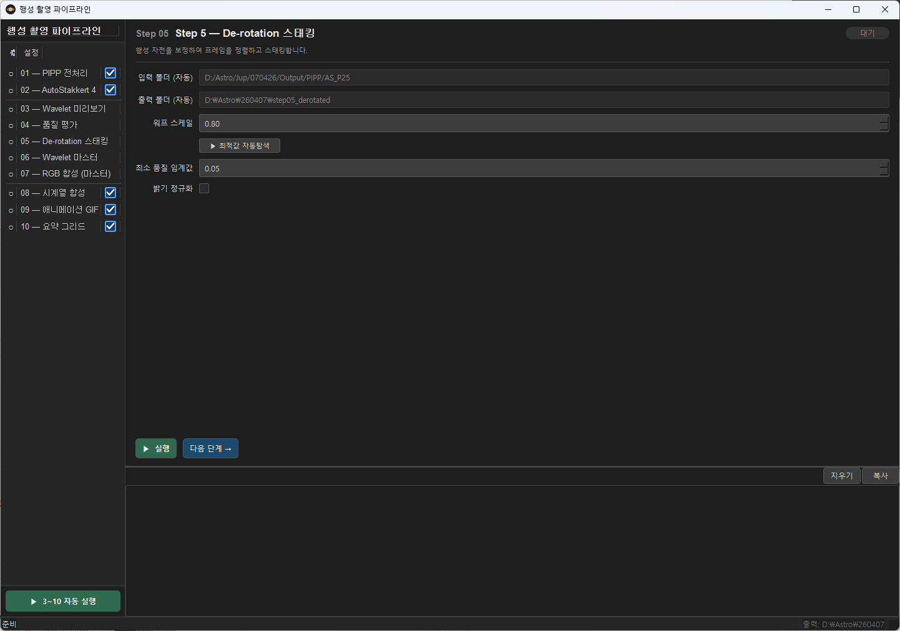
*그림 8-1: Step 05 패널 — De-rotation 스태킹 설정*

Step 04에서 탐지된 최적 윈도우 내 프레임들을 행성 자전을 보정하며 스태킹합니다.

> **필수 단계**: 이 단계는 건너뛸 수 없습니다.

### 8.1 파라미터

| 파라미터 | 기본값 | 범위 | 설명 |
|----------|--------|------|------|
| **입력 폴더** | 자동 설정 | — | Step 04와 동일한 AS!4 TIF 폴더가 자동으로 설정됩니다. |
| **출력 폴더** | 자동 설정 | — | De-rotation 스태킹 마스터 TIF가 저장됩니다. |
| **워프 스케일** | 0.80 | 0.0–2.0 | 행성의 구면 왜곡 보정 강도입니다. 0.8 정도가 일반적입니다. 목성처럼 납작한 행성의 적도 부근 프레임 스태킹에 중요합니다. 0.0 = 보정 없음. |
| **최소 품질 임계값** | 0.05 | 0.0–1.0 | 이 점수 미만의 프레임은 스태킹에서 제외됩니다. 시잉이 나쁜 날에는 0.3~0.5로 높여 나쁜 프레임을 더 엄격하게 제거합니다. |
| **밝기 정규화** | Off | — | 스태킹 전 각 프레임의 밝기를 정규화합니다. 시잉 변화로 프레임 간 밝기 차이가 클 경우 활성화합니다. 일반적인 촬영 조건에서는 비활성화가 권장됩니다. |

---

## 9. Step 06 — Wavelet 마스터 선명화

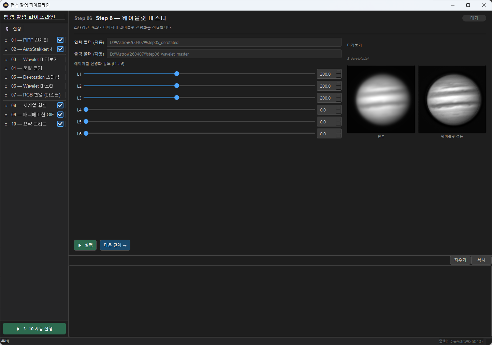
*그림 9-1: Step 06 패널 — 마스터 이미지 웨이블릿 선명화*

Step 05에서 생성된 마스터 TIF 이미지에 웨이블릿 선명화를 적용합니다. 마스터 이미지는 수천 장의 프레임을 스태킹한 결과이므로 노이즈가 매우 낮아 Step 03보다 더 강한 선명화를 적용할 수 있습니다.

> **필수 단계**: 이 단계는 건너뛸 수 없습니다.

### 9.1 파라미터

| 파라미터 | 기본값 | 범위 | 설명 |
|----------|--------|------|------|
| **입력 폴더** | 자동 설정 | — | Step 05 de-rotation 결과 TIF 폴더가 자동으로 설정됩니다. |
| **출력 폴더** | 자동 설정 | — | 웨이블릿 처리된 마스터 PNG가 저장됩니다. |

### 9.2 웨이블릿 레벨 (L1 ~ L6)

Step 03과 동일한 구조입니다. 단, 마스터 이미지에 적용되므로 통상적으로는 **더 강한 값을 사용해도 안전**합니다.

| 레벨 | 기본값 | 권장 범위 | 특성 |
|------|--------|-----------|------|
| **L1** | 200 | 100–400 | 픽셀 수준의 최고 해상도 디테일 |
| **L2** | 200 | 100–400 | 세밀한 구조 (벨트, 줄무늬) |
| **L3** | 200 | 50–300 | 중간 규모 구조 |
| **L4** | 0 | 0–100 | 대규모 명암 대비 |
| **L5** | 0 | 0 | 사용 비권장 |
| **L6** | 0 | 0 | 사용 비권장 |

---

## 10. Step 07 — RGB 합성 (마스터)

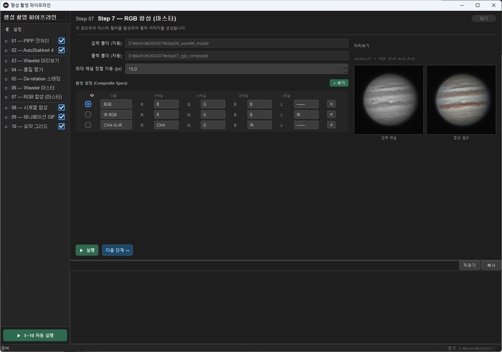
*그림 10-1: Step 07 패널 — RGB 합성 설정과 실시간 미리보기*

Step 06의 필터별 마스터 PNG를 합성하여 컬러 이미지를 생성합니다. 하나의 세션에서 여러 종류의 합성(RGB, LRGB, 위색 등)을 동시에 만들 수 있습니다.

> **필수 단계**: 이 단계는 건너뛸 수 없습니다.

### 10.1 기본 파라미터

| 파라미터 | 기본값 | 범위 | 설명 |
|----------|--------|------|------|
| **입력 폴더** | 자동 설정 | — | Step 06 마스터 PNG 폴더가 자동으로 설정됩니다. |
| **출력 폴더** | 자동 설정 | — | RGB 합성 결과 PNG가 저장됩니다. |
| **최대 채널 이동량 (px)** | 15.0 | 0.0–100.0 | 채널 간 위상 정렬(phase correlation)에서 허용하는 최대 이동 거리입니다. 이 값보다 큰 이동이 계산되면 정렬을 적용하지 않습니다 (잘못된 정렬 방지). 대기 분산이 심한 날에는 20~30으로 높여보세요. |

### 10.2 합성 설정 테이블

각 행(Row)이 하나의 합성 이미지를 정의합니다.

| 열 | 설명 |
|----|------|
| **👁 (라디오 버튼)** | 어느 합성을 미리보기에 표시할지 선택합니다. 한 번에 하나만 선택됩니다. |
| **이름** | 합성 이미지의 이름입니다. 출력 파일명에 사용됩니다 (예: `RGB_composite.png`). |
| **R 채널** | 빨간 채널에 할당할 필터를 선택합니다. |
| **G 채널** | 초록 채널에 할당할 필터를 선택합니다. |
| **B 채널** | 파란 채널에 할당할 필터를 선택합니다. |
| **L 채널** | 루마(밝기) 채널에 할당할 필터입니다. 선택하면 **LRGB 합성** 모드가 됩니다. `──` = 미사용 (일반 RGB). |
| **✕** | 이 합성 설정을 삭제합니다. |

#### 기본 합성 설정

| 이름 | R | G | B | L | 설명 |
|------|---|---|---|---|------|
| **RGB** | R | G | B | (없음) | 기본 3색 합성 |
| **IR-RGB** | R | G | B | IR | IR을 루마로 사용하는 LRGB. 적외선 채널의 높은 해상도가 밝기 디테일을 살립니다. |
| **CH4-G-IR** | CH4 | G | IR | (없음) | 메탄 밴드 위색 합성. 목성의 구름 구조 및 대적점 특성을 강조합니다. |

#### + 추가 버튼

새로운 합성 설정을 추가합니다. 예: `UV-RGB` (R=UV, G=R, B=B) 등 원하는 필터 조합을 자유롭게 만들 수 있습니다.

### 10.3 실시간 미리보기

우측에 현재 선택된(라디오 버튼) 합성의 미리보기가 표시됩니다.

- **좌측 패널 (입력 채널)**: 참조 채널(L 미설정 시 R, LRGB 시 L)의 그레이스케일 이미지
- **우측 패널 (합성 결과)**: 설정된 R/G/B(/L) 채널을 합성한 결과

R/G/B/L 채널 드롭다운을 변경하면 400ms 후 미리보기가 자동 갱신됩니다.

> **참고**: 미리보기는 채널 정렬(phase correlation) 없이 빠르게 계산됩니다.

---

## 11. Step 08 — 시계열 RGB 합성

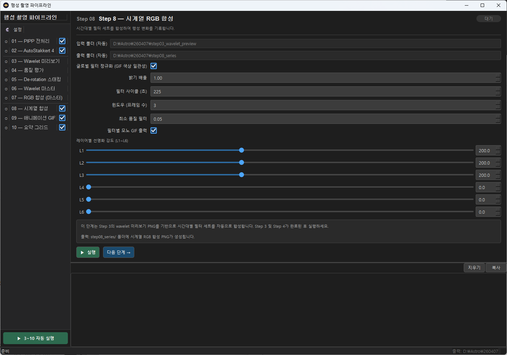
*그림 11-1: Step 08 패널 — 시계열 합성 설정*

Step 03 웨이블릿 미리보기 PNG를 사용하여 시간대별 RGB 합성 이미지를 생성합니다. 행성 자전 시계열 분석에 사용합니다.

> **선택적 단계**: 시계열 합성이 필요 없는 경우 건너뛰세요.

### 11.1 동작 방식

1. Step 02 출력 폴더의 모든 TIF 파일을 스캔합니다.
2. Step 04, 05와 동일한 방식으로 모든 필터별 프레임을 윈도우에 맞춰서 1프레임 단위로 스택한 그룹들을 구성합니다.
3. 각 그룹에서 Step 07의 합성 설정과 동일하게 RGB 합성합니다.
4. 결과는 `step08_series/` 폴더에 시간 순서로 저장됩니다.
---

## 12. Step 09 — 애니메이션 GIF

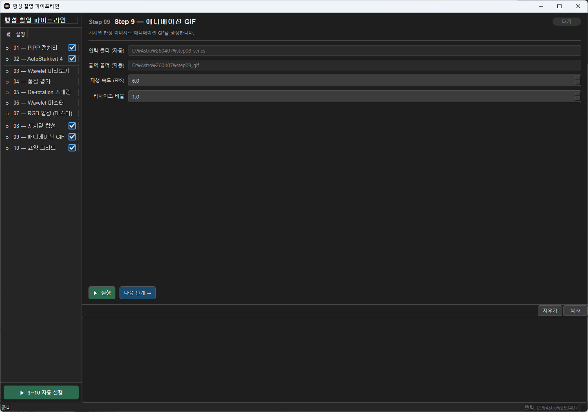
*그림 12-1: Step 09 패널 — GIF 애니메이션 설정*

Step 08의 시계열 합성 결과를 이어붙여 행성 자전 애니메이션 GIF를 생성합니다.

> **선택적 단계**: Step 08이 실행된 경우에만 사용 가능합니다.

### 12.1 파라미터

| 파라미터 | 기본값 | 범위 | 설명 |
|----------|--------|------|------|
| **입력 폴더** | 자동 설정 | — | Step 08 시계열 합성 PNG 폴더가 자동으로 설정됩니다. |
| **출력 폴더** | 자동 설정 | — | GIF 파일이 저장됩니다. |
| **FPS** | 6.0 | 1.0–30.0 | GIF 재생 속도(초당 프레임 수)입니다. 값이 낮을수록 천천히 재생됩니다. |
| **크기 배율** | 1.0 | 0.1–2.0 | 출력 GIF의 크기 배율입니다. |

---

## 13. Step 10 — 요약 그리드

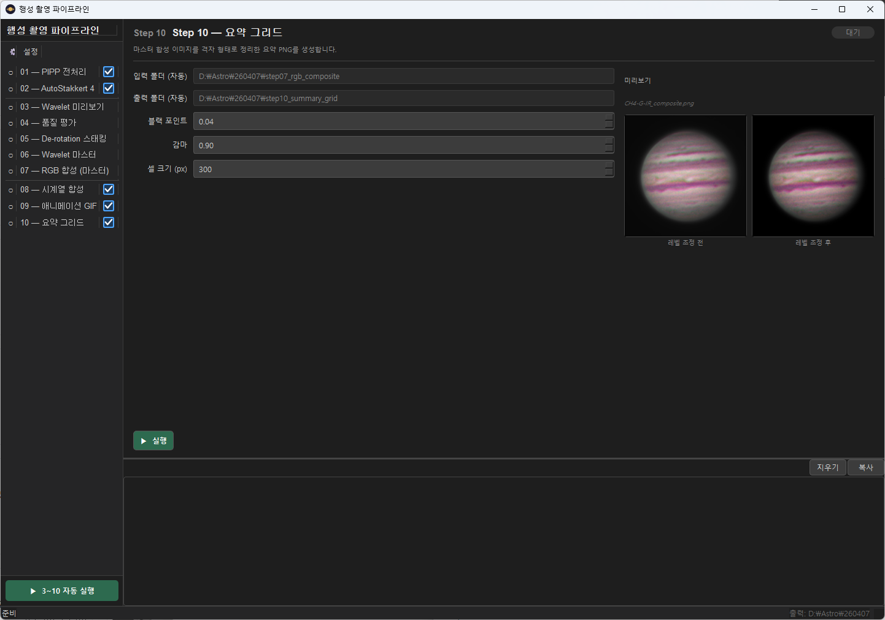
*그림 13-1: Step 10 패널 — 요약 그리드 레벨 조정*

Step 07의 RGB 합성 결과를 레벨 보정하여 하나의 요약 그리드 이미지로 합칩니다. 관측 보고서나 포럼 게시용 최종 이미지 생성에 사용합니다.

> **선택적 단계**: 필요한 경우에만 사용합니다.

### 13.1 파라미터

| 파라미터 | 기본값 | 범위 | 설명 |
|----------|--------|------|------|
| **입력 폴더** | 자동 설정 | — | Step 07 RGB 합성 결과 폴더가 자동으로 설정됩니다. |
| **출력 폴더** | 자동 설정 | — | 요약 그리드 PNG가 저장됩니다. |
| **블랙 포인트** | 0.04 | 0.0–0.5 | 이 값 이하의 픽셀을 순수 검정(0)으로 처리합니다. 배경 하늘 노이즈를 억제하고 행성의 테두리를 깔끔하게 만듭니다. **0.02~0.08** 범위를 권장합니다. |
| **화이트 포인트** | 1.0 | 0.5–1.0 | 이 값 이상의 픽셀을 순수 흰색(1.0)으로 처리합니다. 과포화된 픽셀을 클리핑할 때 사용합니다. 대부분 1.0으로 유지합니다. |
| **감마 (Gamma)** | 0.9 | 0.1–3.0 | 밝기 감마 보정값입니다. **1.0** = 보정 없음 / **< 1.0** = 밝아짐 (대부분 0.8~1.0 권장) / **> 1.0** = 어두워짐. |
| **셀 크기 (px)** | 300 | 100–600 (50 단위) | 그리드에서 각 합성 이미지를 표시할 크기(px)입니다. |

### 13.2 실시간 미리보기

우측에 레벨 조정 전후 미리보기가 표시됩니다.

- **레벨 조정 전**: Step 07 출력 원본 이미지
- **레벨 조정 후**: 블랙 포인트 + 감마 적용 후 이미지

파라미터를 변경하면 400ms 후 미리보기가 자동 갱신됩니다.

---

## 14. 전체 실행 (Run All)

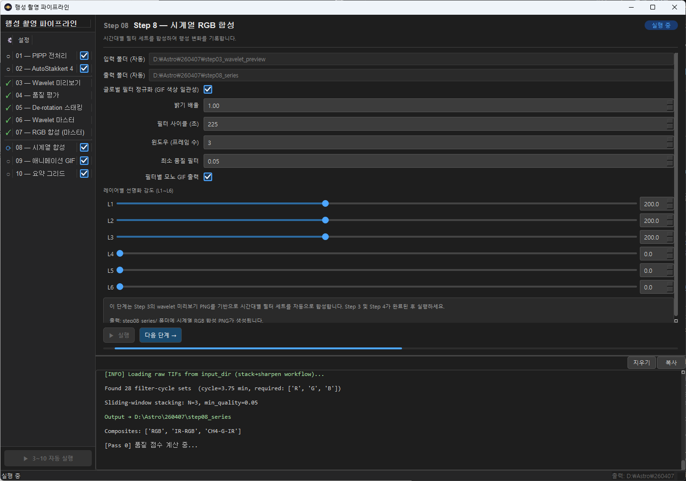
*그림 14-1: 전체 실행 중 화면*

좌측 사이드바 하단의 **"전체 실행"** 버튼을 클릭하면 Step 03부터 Step 10까지 순서대로 자동 실행합니다.

- Step 01은 필수가 아니며 Step 02는 외부 도구(AS!4) 의존이므로 자동 실행에서 제외됩니다.
- 선택적 단계인 Step 08, 09, 10은 설정에 따라 포함/제외됩니다.
- 실행 중 오류가 발생하면 해당 단계에서 중단되고 오류 메시지가 로그에 출력됩니다.

---

## 15. 출력 폴더 구조

파이프라인 실행 후 출력 기준 폴더(예: `260402_output/`) 아래에 다음 폴더가 생성됩니다.

```
{output_base}/
├── step03_wavelet_preview/     # Step 03: 웨이블릿 처리된 미리보기 PNG
│   ├── 2026-03-20-1046_1-U-IR-Jup_..._wavelet.png
│   └── ...
├── step04_quality/             # Step 04: 품질 평가 결과
│   ├── quality_scores.csv
│   ├── windows.json
│   └── windows_summary.txt
├── step05_derotate_stack/      # Step 05: De-rotation 마스터 TIF
│   └── window_01/
│       ├── IR_master.tif
│       ├── R_master.tif
│       └── ...
├── step06_wavelet_master/      # Step 06: 웨이블릿 마스터 PNG
│   └── window_01/
│       ├── IR_master.png
│       ├── R_master.png
│       └── ...
├── step07_rgb_composite/       # Step 07: RGB 합성 PNG
│   └── window_01/
│       ├── RGB_composite.png
│       ├── IR-RGB_composite.png
│       ├── CH4-G-IR_composite.png
│       └── composite_log.json
├── step08_series/              # Step 08: 시계열 합성 PNG
│   ├── 2026-03-20T10:46_RGB.png
│   └── ...
├── step09_gif/                 # Step 09: 애니메이션 GIF
│   └── RGB_animation.gif
└── step10_summary_grid/        # Step 10: 요약 그리드 PNG
    └── summary_grid.png
```